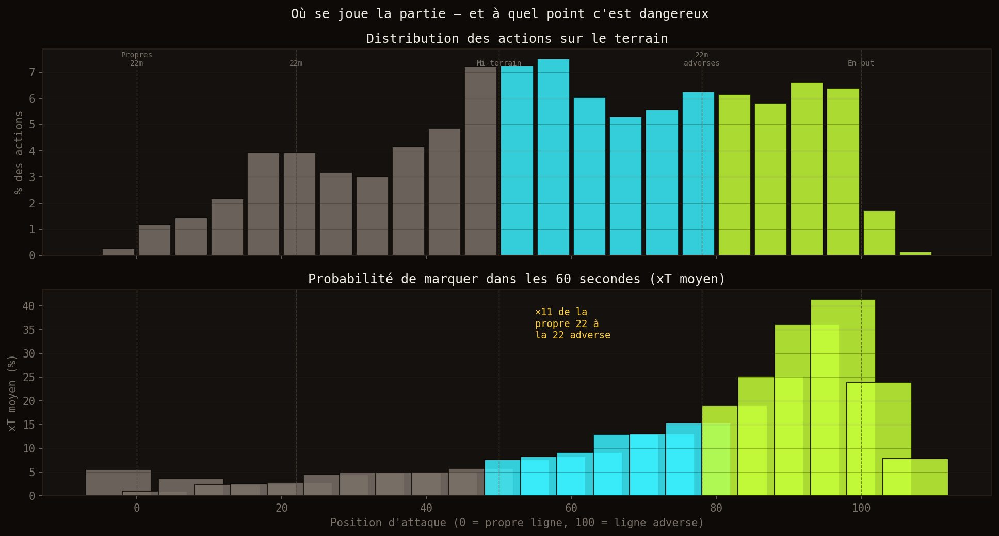
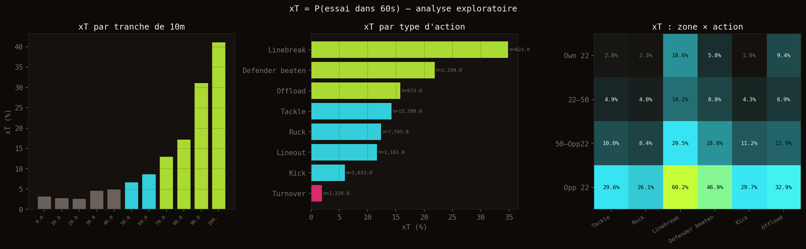
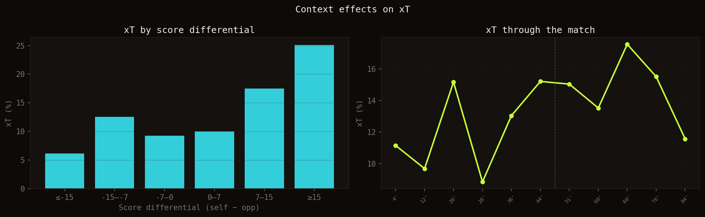
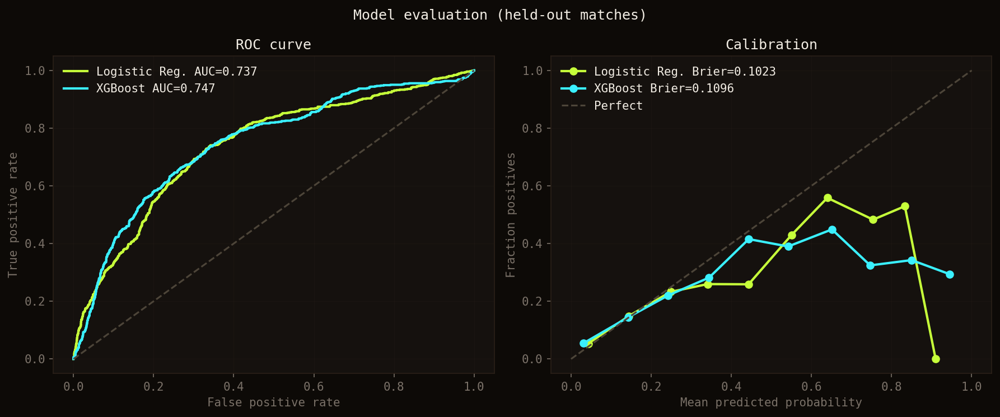
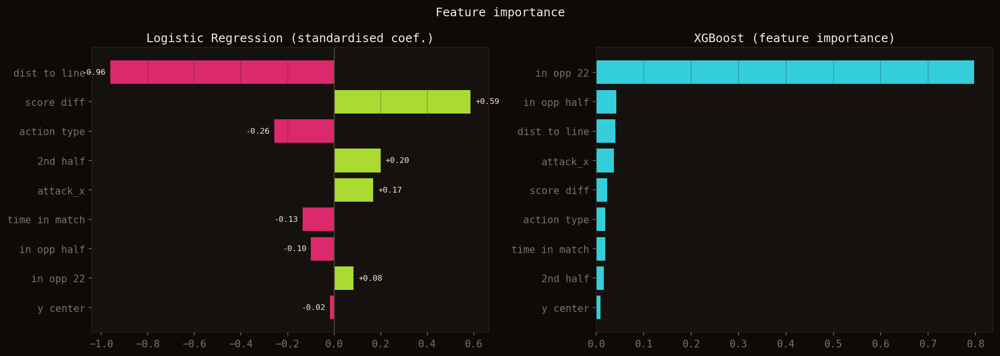
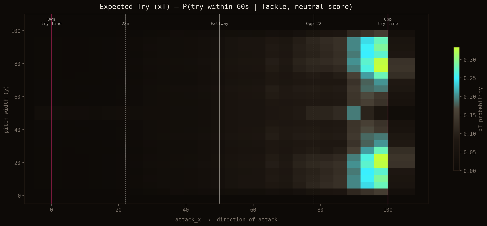
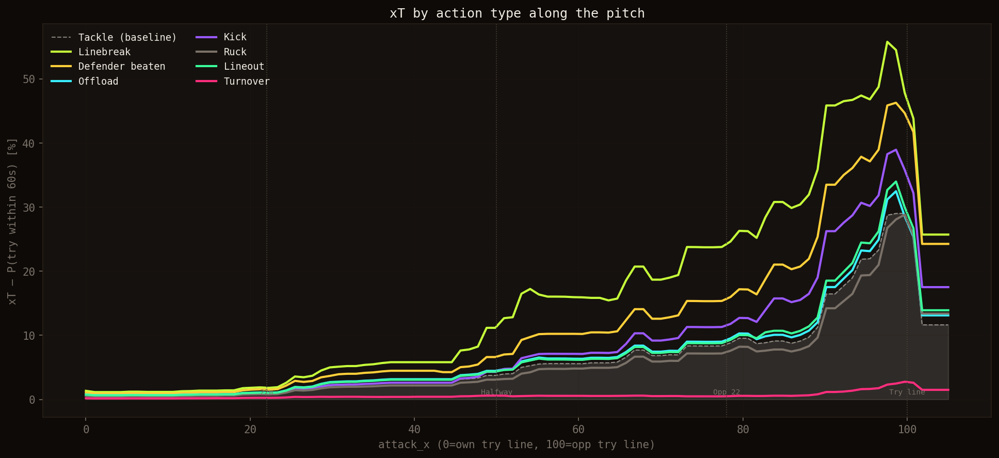
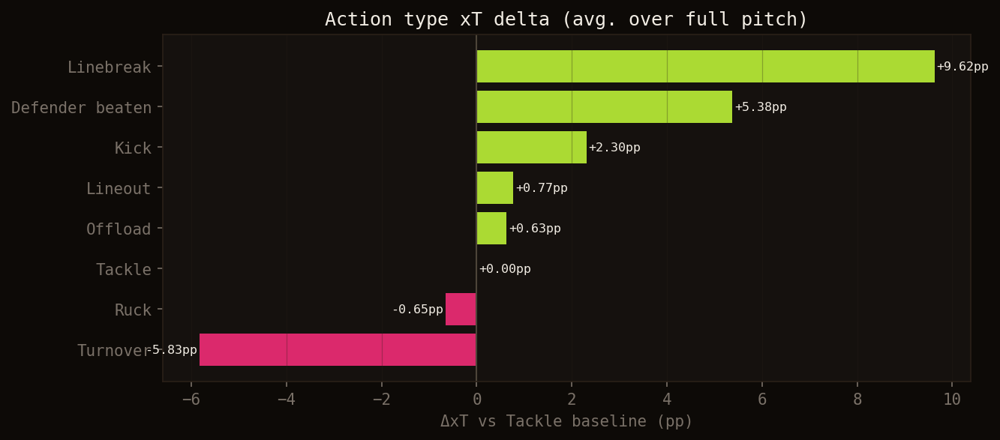
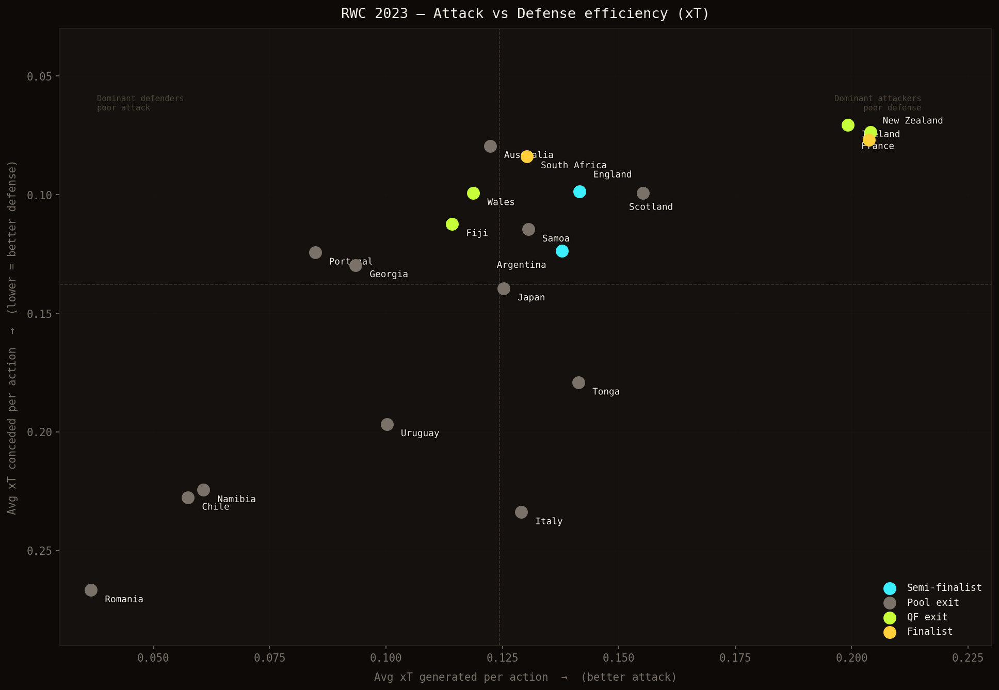

# L'Expected Try (xT) : donner une valeur à chaque action

En football, l'**Expected Goals (xG)** est devenu incontournable : chaque tir reçoit une probabilité d'être transformé en but, selon la position, l'angle, le type d'action. Un tir du point de penalty vaut ~0.76 xG. Une tête de coin vaut ~0.05.

Rugby. Même problème, même question : **à quel point est-ce que cette action met l'équipe adverse en danger ?** Un ruck à mi-terrain n'est pas une cassure de ligne à 5 mètres de l'en-but. Une touche bien gagnée dans les 22 adverses n'a pas la même valeur qu'un ballon récupéré sur une interception.

L'**Expected Try (xT)** répond à ça : *quelle est la probabilité que l'équipe en possession marque un essai dans les 60 prochaines secondes, depuis cette position, avec cette action ?*

Les données : **48 matchs de la Coupe du Monde 2023** avec positions GPS de chaque action — 32 000+ événements, 325 essais.

# 1. La géographie du danger

La première chose que montre l'analyse est un écart brutal entre où se déroule le jeu et à quel point chaque zone est réellement dangereuse.

*En haut : distribution de toutes les actions sur le terrain. En bas : xT moyen (probabilité d'essai dans 60s) par zone. Le gradient est spectaculaire.*

La moitié de toutes les actions se déroulent entre les deux lignes de 22 mètres. C'est là que se jouent la majorité des mêlées, des rucks, des touches. Et pourtant, l'xT dans cette zone est quasiment nul — entre 3 % et 5 %. **Avoir le territoire ne signifie pas être dangereux.**

La probabilité de marquer dans les 60 secondes suivantes passe de **2,7 %** dans ses propres 22 mètres à **29,7 %** dans les 22 adverses — une multiplication par 11. C'est ce gradient qui justifie l'ensemble du modèle.

# 2. Le système de coordonnées

Les données GPS utilisent une convention où `x` va de 0 à 100 (ligne d'en-but propre → ligne d'en-but adverse). Problème : à la mi-temps, les équipes changent de côté. Un `x = 80` en première période ne signifie pas la même chose qu'en deuxième.

Pour chaque match et chaque mi-temps, on infère la direction d'attaque de chaque équipe à partir des positions des essais. On convertit ensuite chaque événement en `attack_x` : **0 = propre ligne d'en-but, 100 = ligne adverse**. L'équipe attaque toujours vers la droite dans ce repère.

# 3. La définition du label

Le label est binaire : **l'équipe en possession marque-t-elle un essai dans les 60 secondes suivant cet événement ?**

Pourquoi 60 secondes ? C'est la fenêtre qui capture la menace immédiate sans confondre avec une longue phase de possession. Sur 32 123 événements, **13,4 % sont positifs** — un déséquilibre réaliste, loin du tirage à pile ou face.

La possession est déduite du type d'action :
- **Tackle** → l'équipe qui tackle défend, donc l'autre est en possession
- **Turnover** → l'équipe qui récupère est en possession
- Tous les autres → l'équipe qui agit est en possession

La validation croisée utilise un **GroupKFold par match** — aucun événement d'un match de test n'apparaît dans l'entraînement. Sans ça, le modèle mémorise les matchs au lieu d'apprendre le jeu.

# 4. L'analyse exploratoire

## xT par zone et par action

*De gauche à droite : xT moyen par tranche de 10m, par type d'action, et la matrice zone × action.*

Par type d'action, la hiérarchie est sans appel. Une **cassure de ligne** vaut 16 % de probabilité d'essai dans la minute — 2,5 fois plus qu'un ruck ordinaire (6 %). Un **turnover** s'effondre à 0,6 % : perdre le ballon annule quasi instantanément toute menace.

La matrice zone × action (à droite) révèle un effet de levier important : dans les 22 adverses, même un simple ruck dépasse 20 % d'xT. La position amplifie la valeur de chaque action.

## L'effet du contexte

*Gauche : xT selon le différentiel de score. Droite : évolution de l'xT au fil du match.*

Le score a un effet modeste : une équipe qui mène ou qui est menée de moins de 7 points maintient un xT similaire. Les grandes menées réduisent légèrement l'intensité offensive — les équipes gèrent.

En revanche, **le danger augmente nettement en fin de match**. L'xT progresse dans les 20 dernières minutes : les équipes prennent plus de risques, les défenses fatiguent, les espaces s'ouvrent.

# 5. Le modèle

## Variables

9 variables en entrée : position longitudinale (`attack_x`), distance au centre (`y_center`), distance à la ligne adverse (`dist_line`), indicateurs de zone (`in_opp_22`, `in_opp_half`), différentiel de score, avancement dans le match, mi-temps, et type d'action.

## Validation sans fuite de données

**GroupKFold(5 folds)** par identifiant de match. Résultats en cross-validation :

- Régression logistique : **AUC 0.788** ± 0.033
- XGBoost : **AUC 0.768** ± 0.022

La régression logistique surpasse légèrement XGBoost en généralisation — le gradient de position est suffisamment linéaire pour que la simplicité soit un avantage.

## Évaluation sur les matchs de test

*Courbes ROC (gauche) et calibration (droite) sur les 20 % de matchs réservés au test.*

La calibration est solide. Un événement prédit à 20 % se traduit bien par un essai dans ~20 % des cas — le modèle ne sur-estime ni ne sous-estime systématiquement.

## Importance des variables

*Coefficients standardisés de la régression logistique (gauche) et importance XGBoost (droite).*

Les deux modèles racontent la même histoire de manières différentes.

**En régression logistique**, `dist_to_line` (distance à la ligne adverse) domine avec un coefficient de −0.96 — négatif parce qu'une distance plus courte signifie plus de danger. `attack_x` apparaît beaucoup plus faible (+0.17), non pas parce qu'il est moins important, mais parce que `dist_to_line = 100 − attack_x` : les deux variables sont parfaitement corrélées et la LR répartit le même signal entre elles. Collectivement, les quatre variables de position (`dist_to_line`, `attack_x`, `in_opp_22`, `in_opp_half`) représentent la même information physique : où se trouve l'équipe.

`score_diff` apparaît en deuxième position (+0.58). C'est en partie un signal réel — les équipes qui mènent attaquent souvent une défense fatiguée ou désorganisée — mais aussi un artefact des matchs à sens unique (Afrique du Sud vs Roumanie, par exemple), où le différentiel explose en même temps que les essais se multiplient.

**En XGBoost**, une seule variable domine à 80 % d'importance : `in_opp_22`. Le modèle a identifié le franchissement de la ligne des 22 mètres adverses comme le seuil décisif. Au-delà, le danger explose ; en deçà, il reste contenu.

**Les deux modèles convergent vers la même conclusion : la position est le facteur dominant, et entrer dans les 22 adverses est la frontière qui change tout.**

# 6. La carte de danger

*xT = P(essai dans 60s) pour un ruck standard, score neutre, milieu de match.*

La probabilité part de quasi-zéro sur la propre ligne d'en-but, monte progressivement jusqu'à la moitié, s'accélère dans la moitié adverse, et explose dans les 22 adverses pour atteindre 20–35 % selon la position latérale.

À noter : **le centre du terrain est légèrement plus dangereux que les ailes** à position longitudinale égale. Les actions au centre conservent des options offensives dans les deux directions.

# 7. La valeur des actions

## xT par type d'action le long du terrain

*Chaque courbe : xT moyen pour un type d'action selon la position. Zone grisée = ruck de référence.*

## Ce que chaque action ajoute

*Gain ou perte moyen d'xT par rapport à un ruck de référence, moyenné sur tout le terrain.*

- **Cassure de ligne** : +9,6 pp. Une cassure à mi-terrain vaut autant qu'un ruck à 20 mètres de la ligne.
- **Défenseur battu** : +5,4 pp. Battre un homme devant soi double presque le danger par rapport à un ruck.
- **Coup de pied** : +2,3 pp. Les coups de pied offensifs visent l'espace derrière la défense — souvent en zone dangereuse.
- **Turnover** : −5,8 pp, xT moyen 0,6 %. Perdre le ballon annule instantanément toute menace.

# 8. Quelle équipe a créé le plus de danger à la Coupe du Monde 2023 ?

En appliquant le modèle à chaque action des 48 matchs, on peut calculer pour chaque équipe deux métriques : l'**xT moyen généré** (qualité offensive) et l'**xT moyen concédé** (solidité défensive).

*Chaque point est une équipe. À droite = meilleure attaque. En haut = meilleure défense. Les finalistes en jaune, les demi-finalistes en bleu.*

Les résultats révèlent une histoire fascinante :

**La France et la Nouvelle-Zélande ont été les équipes les plus dangereuses offensivement** avec un xT généré de 0.204, loin devant. L'Irlande complète le podium à 0.199. Ces trois équipes avaient aussi les meilleures défenses du tournoi.

**L'Afrique du Sud, championne du monde, était l'équipe la plus efficace — pas la plus dominante.** Avec un xT généré de seulement 0.130 (modeste), mais une défense de fer à 0.084 (3e meilleure), les Springboks ont construit leur titre sur une philosophie radicalement différente : réduire le danger concédé plutôt que maximiser le danger créé. 3,9 essais par match en moyenne — et en finale contre la Nouvelle-Zélande, ils ont gagné sans marquer le moindre essai.

**Le paradoxe français :** la France a généré autant de danger que la Nouvelle-Zélande et concédé aussi peu que l'Irlande — meilleure attaque et meilleure défense du tournoi selon l'xT. Et pourtant, éliminée en quart de finale par l'Afrique du Sud. Ce genre d'écart entre performance xT et résultat sportif est précisément ce que ce type de modèle permet de mesurer — et de remettre en question.

# 9. Ce que le modèle ne capture pas encore

- **Le tempo** : deux rucks à même position ne sont pas équivalents si l'un se joue en 4 secondes et l'autre en 12
- **La densité défensive** : le nombre de défenseurs entre le ballon et la ligne
- **Les phases statiques spécifiques** : touche à 5 mètres, mêlée dominante
- **La transférabilité** : ce modèle est entraîné sur la Coupe du Monde 2023. En TOP 14 ou Pro D2, les profils de jeu sont différents

# Conclusion

L'Expected Try transforme chaque action en une unité de danger comparable. Une cassure de ligne à mi-terrain n'est plus juste "une belle action" — c'est 16 % de probabilité d'essai dans la minute. Un turnover dans les 22 adverses n'est plus juste "une perte de balle" — c'est une chute à 0,6 %.

Et quand on l'applique à l'ensemble d'un tournoi, l'xT permet de raconter une histoire que le tableau des scores ne raconte pas : la France a peut-être été la meilleure équipe du Mondial 2023 selon les données. C'est le sport.

Le notebook complet et les données sont disponibles dans le [dépôt GitHub du projet](https://github.com/baptisteMonpezat/data-ruck). Des questions ou des idées ? N'hésitez pas à me contacter !
