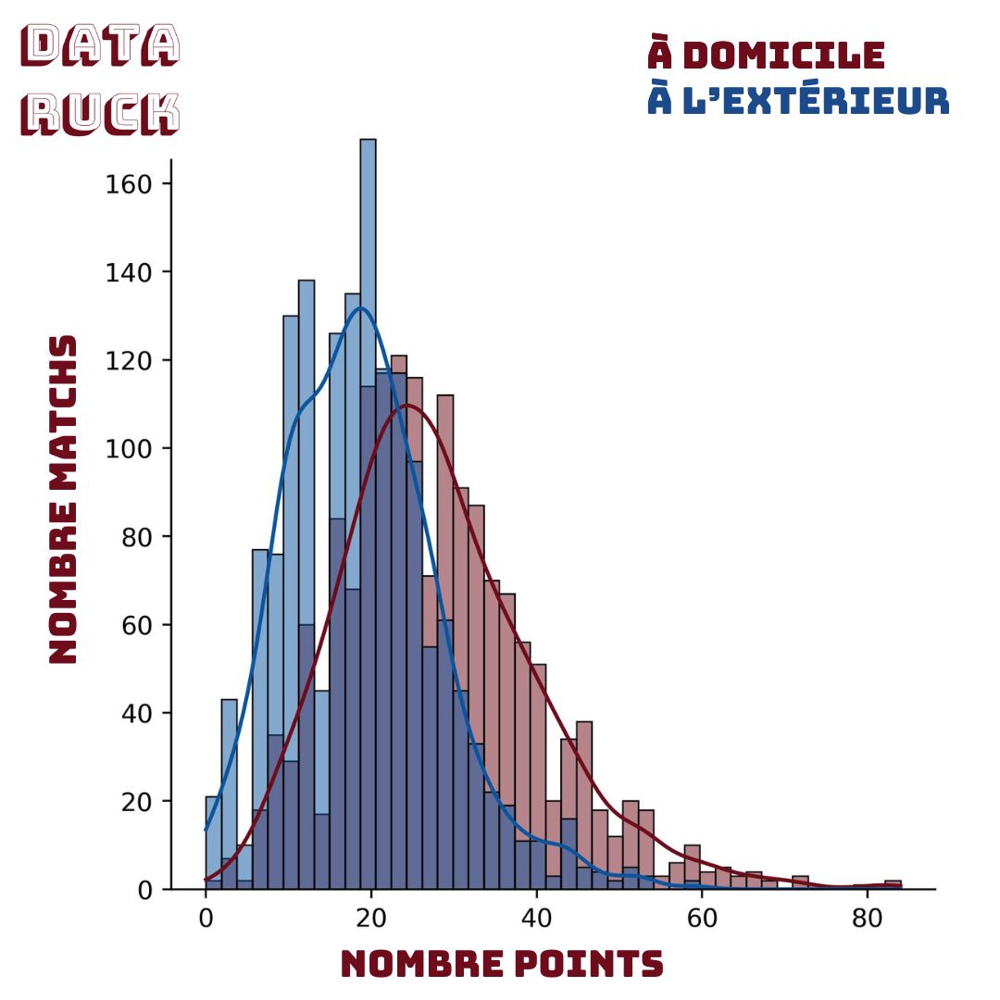
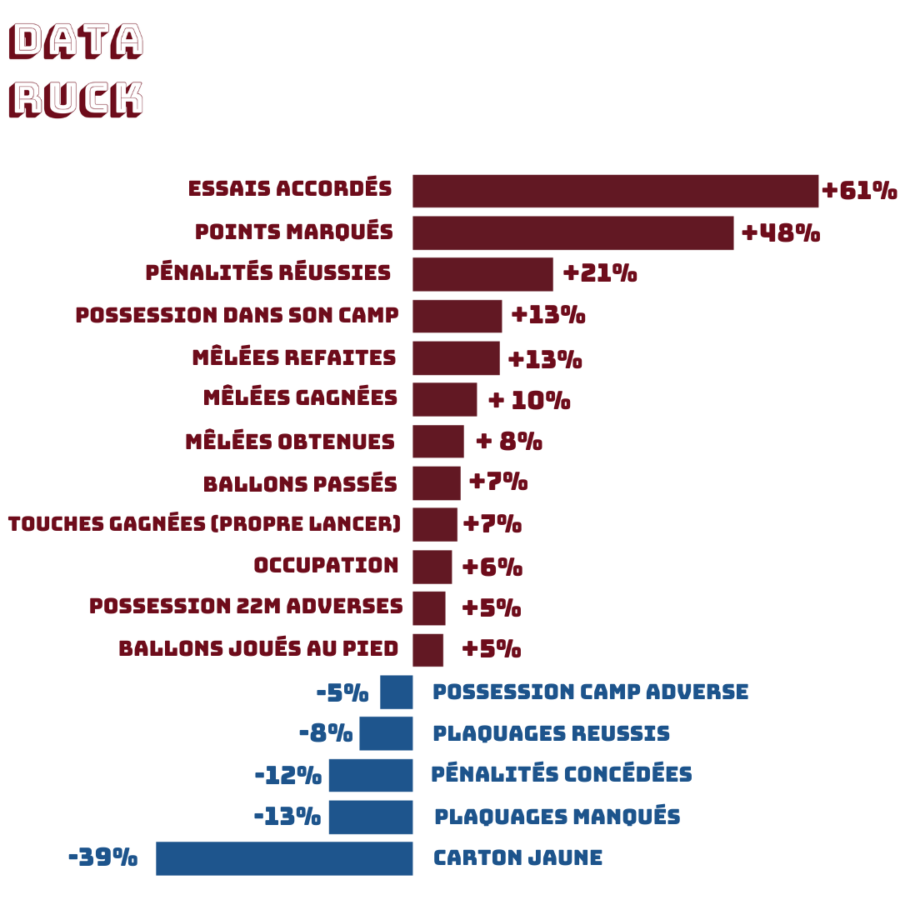
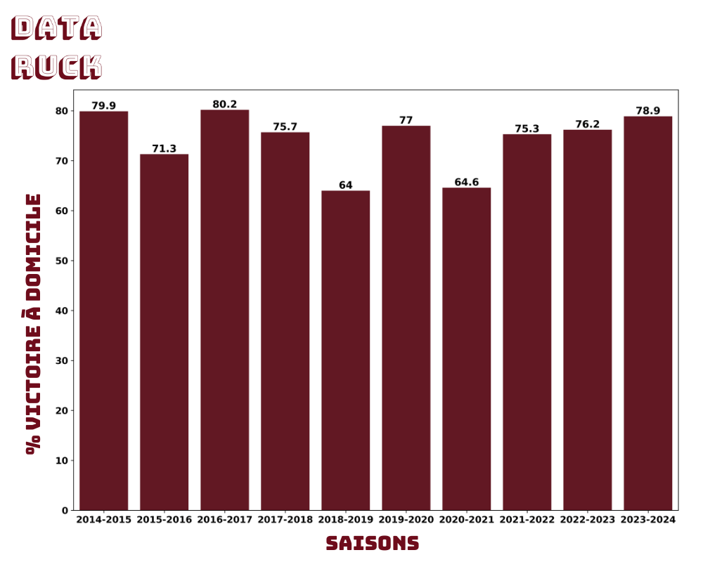
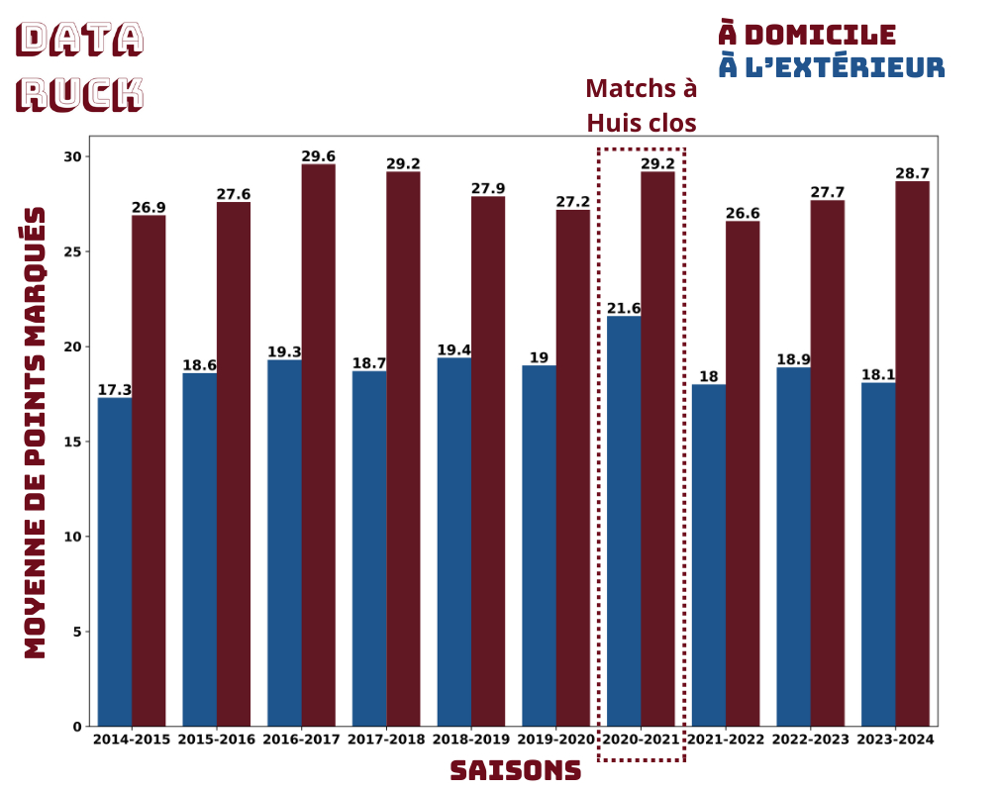
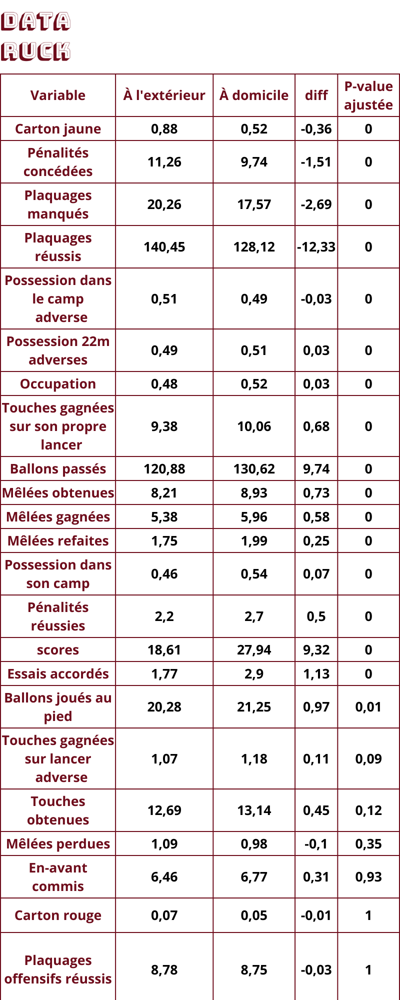

 
# Favoris à domicile: mythe ou réalité ? 

Avez-vous regardé la terrible défaite du XV de France contre l'Irlande pour l'ouverture du tournoi des 6 nations ?
Je vous l'accorde, le fait de jouer à domicile ne semble pas avoir été un avantage pour notre équipe de France...
La défaite aurait-elle été plus marquée si le match avait été joué à Dublin ? Nous ne saurons jamais... 

Néanmoins, un évènement a attiré mon attention et m'a donné l'idée d'écrire cet article. 

Nous sommes à la 50ème minute, le demi de mêlée Irlandais Jamison Gibson Park fait une passe au pied par dessus la ligne de défense 
française. Gaël Fickou s'élance dans les airs pour capter le ballon, mais il se fait bousculer par le demi d'ouverture Irlandais Jack Crowley.
Le ballon est récupéré au sol par un joeur Français hors jeu, l'équipe de France est pénalisée et les Irlandais trouvent une touche 
à dix mètres de notre ligne d'en but. Pour rappel, il est interdit de charger un joueur dans les airs. Les supporters Français sont mécontents de la décision arbitrale 
et le stade Vélodrome se met à gronder. Sous la pression populaire, l'arbitre revient sur sa décision et accorde une pénalité 
pour l'équipe de France.  

*Plaquage dans les airs sur Gaël Fickou lors du match France Irlande*

Vous l'avez compris avec cet exemple, le fait de jouer à domicile peut avoir une influence sur le jeu: ici sur une décision arbitrale. 

L'objectif de cet article est d'évaluer l'avantage que tirent les équipes du TOP 14 en jouant à domicile.
Un sujet qui, bien que complexe, a été relativement peu exploré dans le domaine du rugby.
Pour ce faire, j'ai examiné les données de 1641 matchs du TOP 14 qui se sont déroulés depuis la saison 2014-2015.

# Les facteurs qui y contribuent 

Les facteurs qui font qu'une équipe est favorisée à domicile sont multiples: 
- **Fatigue du voyage**: les déplacements longue distance peuvent entraîner de la fatigue chez les joueurs, 
ce qui peut affecter leur performance sur le terrain.
- **Familiarité avec le terrain**: Jouer à domicile signifie jouer sur un terrain que l'équipe connaît bien. À l'extérieur, 
les conditions du terrain peuvent varier, ce qui peut affecter le jeu de l'équipe.
- **Soutien du public**: le public à domicile joue un rôle important en motivant leur équipe 
et en créant une atmosphère intimidante pour l'équipe adverse.
- **Influence de l'arbitrage**: Comme nous l'avons vu avec l'exemple ci-dessus, les arbitres peuvent inconsciemment favoriser 
l'équipe à domicile en raison de la pression de la foule.
- **Routines perturbées**: être à l'extérieur signifie souvent être loin de sa routine habituelle,
ce qui peut affecter la préparation mentale et physique des joueurs.
- **Conditions climatiques**: les équipes qui jouent à domicile sont généralement plus habituées 
aux conditions climatiques locales, ce qui peut être un désavantage pour l'équipe adverse si ces dernières sont 
très différentes de ce qu'elle connaît.

Maintenant que nous avons listé tous les facteurs qui peuvent favoriser une équipe à domicile, il est temps de 
de faire quelques stats pour quantifier cet avantage! 

# Un réel avantage 

En TOP 14, **74% des victoires sont des victoires à domicile**. On peut dire que c'est presque mission impossible d'aller gagner 
à l'extérieur: Une équipe a en moyenne 1 chance sur 5 de remporter un match à l'extérieur. 

Les équipes à domicile marquent en moyenne **9 points de plus que leur adversaire** (la différence de moyenne est statistiquement 
significative $$ p_{value}<0.05 $$, c'est à dire qu'on ne se trompe pas en disant que les équipes à domicile marquent plus de points).

Les équipes à domicile marquent en moyenne 1 essai de plus que leur adversaire. 

*Différence de points pour les matchs à domicile vs extérieur*

*% de Variation entre domicile vs extérieur*

Il ressort de ces analyses que les équipes à domicile ont un jeu plus offensif et ont plus la main sur le ballon. 
On constate une plus grande possession de balle (**+13%**), un plus grand nombre de ballons passés (**+7%**) et plus de ballons 
joués au pied (**+5%**). Les équipes à domicile font également moins de plaquages, **-8% de plaquages réussis et -13% des plaquages manqués.** 

Les botteurs sont plus en confiance: ils réusssisent en moyenne plus de pénalité à domicile (**+21%**).

Pression du public sur les décisions arbitrales ou jeu plus offensif de l'équipe à domicile qui pousse l'adversaire 
à la faute ? Difficile de conclure, mais les équipes à domicile sont moins pénalisées (**-12% de pénalités concédées**) et reçoivent moins de cartons jaunes (**-39%**).

***Voir annexes pour toutes les comparaisons***

# Une expérience de laboratoire ou presque

Qui aurait cru qu'un jour, nous aurions l'occasion d'analyser l'impact du public sur le jeu, 
sans avoir à recourir à des expériences de laboratoire dignes de la NASA ? 

Ah, le Covid-19! Ce petit virus qui a réussi à transformer nos rugbymen en moines du TOP 14, 
jouant leurs matchs dans le silence monastique des stades vides.
Résultat ? Nos équipes locales, privées de leurs supporters, semblent avoir perdu leur mojo à domicile.
On dirait bien que le fameux "avantage du terrain" était moins lié à la qualité de la pelouse qu'à la ferveur des fans. 
Alors, merci le COVID car grâce à toi, nous avons enfin pu mesurer l'impact réel du 16ème homme sur le jeu. 
Et il est clair que sans lui, le rugby perd un peu de son piquant.

En effet de Novembre 2020 à Mai 2021, les matchs de TOP 14 sont joués à huit clos. 
Sur cette période:
- le pourcentage de victoire à domicile est de 64%. On peut donc en déduire que le soutien du 
public augmente d'environ 10% la probabilité de victoire de l'équipe jouant à domicile. 

*% de Victoire à domicile par saison*

Sur la saison 2018-2019, on remarque un pourcentage de victoire à domicile assez faible. Cela s'explique par une grande 
hétérogénéité de niveau entre les équipes. Le Stade Toulousain avait écrasé le championnat avec 88% de victoires (seulement 3 défaites)
alors que l'USAP avait gagné seulement 2 matchs. 

- le nombre de points marqués à l'extérieur est de 22 vs 18.6 pour les autres saisons.

*Moyenne de points Domicile vs Extérieur par saison*

# Discussion 

En conclusion, bien que l'analyse statistique puisse être biaisée par certains facteurs (tels que la préservation des joueurs clés lors des matchs à l'extérieur),
les données indiquent clairement un avantage significatif à jouer à domicile en TOP 14. 

Il est important de noter que ces statistiques ne garantissent pas une victoire à domicile. 
Le rugby est un sport imprévisible et dépendant de nombreux autres facteurs.
Néanmoins, ces chiffres offrent une perspective intéressante de l'impact du terrain d'accueil sur les performances des équipes.

# Annexes 

*Comparaison Domicile vs Extérieur*

*Comparaison Domicile vs Extérieur*

