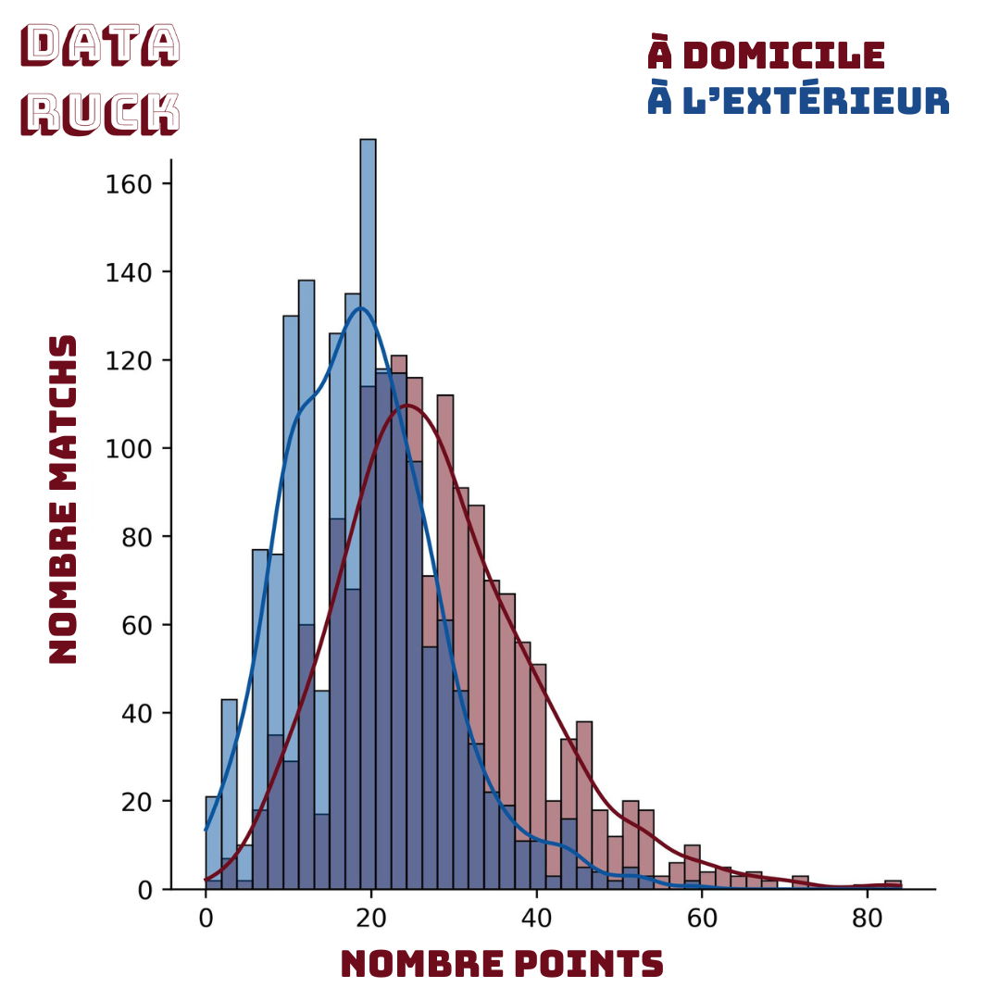
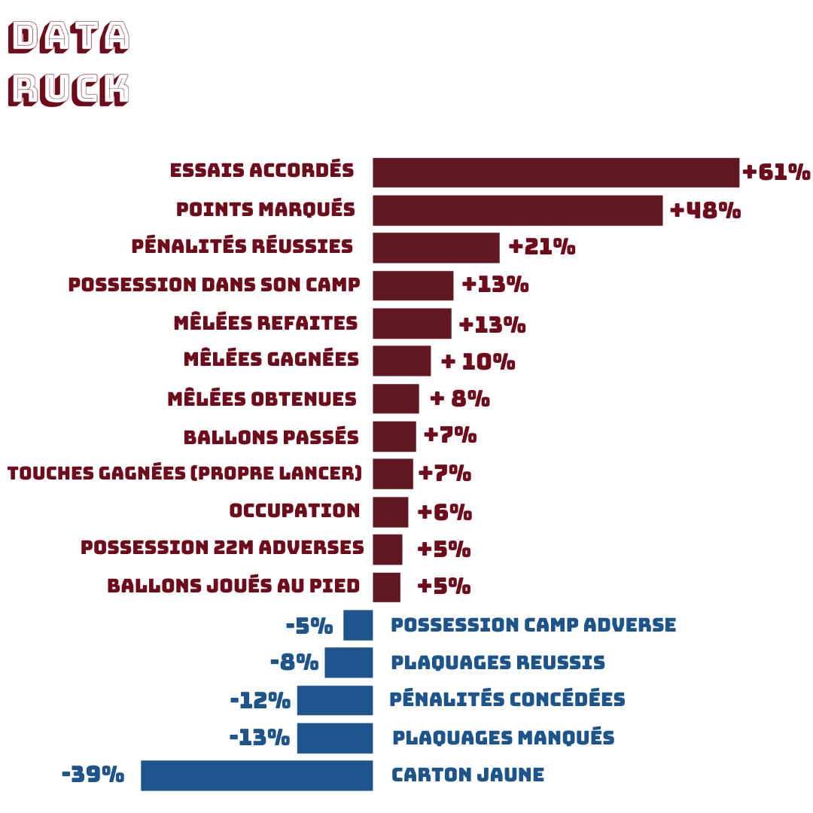
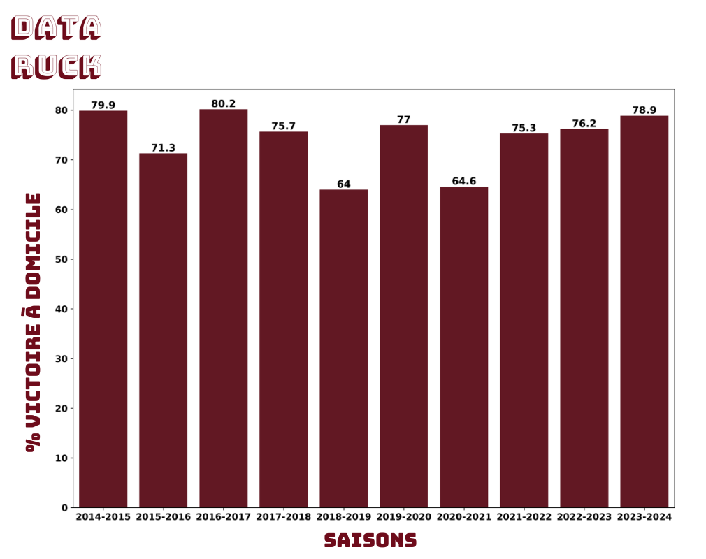
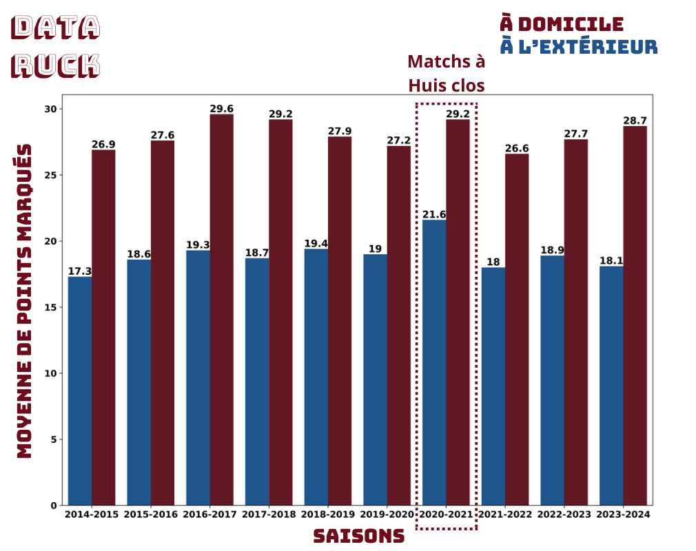
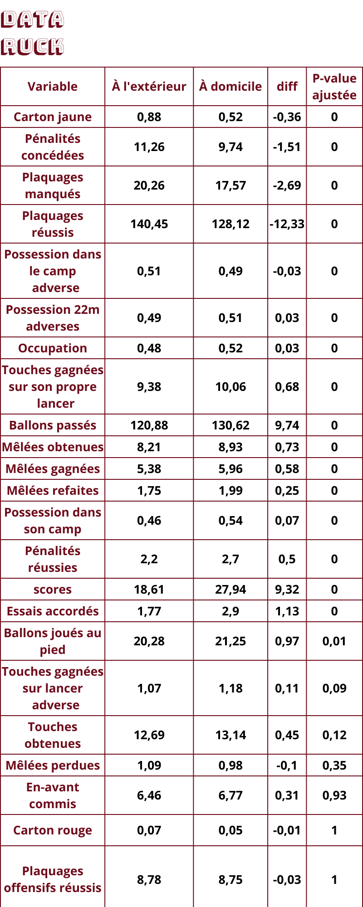

# Home favourites: myth or reality?

Did you watch France's heavy defeat against Ireland in the opening round of the Six Nations?
Fair enough — playing at home clearly didn't help our national team that day…
Would the loss have been even bigger on Irish soil? We'll never know.

One moment from that match, however, caught my attention and gave me the idea for this article.

Around the 50th minute, Irish scrum-half Jamison Gibson-Park chips the ball over the French defensive line. Gaël Fickou jumps to claim it, but is bumped by Irish fly-half Jack Crowley. The ball is recovered on the ground by a French player who was offside — France is penalised, and Ireland earn a lineout ten metres from the French try line. Lifting a player in the air is, of course, illegal. French supporters are furious with the call, and the Vélodrome begins to roar. Under that public pressure, the referee reverses his decision and awards a penalty to France.

*Aerial challenge on Gaël Fickou during France vs Ireland*

As that moment shows, playing at home can influence the game — here, a refereeing decision.

The goal of this article is to quantify the home advantage enjoyed by TOP 14 clubs.
It's a topic that, while complex, has been relatively little explored in rugby analytics.
To do so, I examined data from 1,641 TOP 14 matches played since the 2014–15 season.

# The contributing factors

Several factors can give a team an edge at home:
- **Travel fatigue**: long journeys can leave visiting players tired, affecting their performance.
- **Familiarity with the ground**: home teams know their pitch well. Surface conditions can vary, and that difference can disrupt a visiting side's game.
- **Crowd support**: a home crowd motivates the home team and creates an intimidating atmosphere for the opposition.
- **Refereeing influence**: as seen above, referees may unconsciously favour the home side under crowd pressure.
- **Disrupted routines**: being away from home often means being away from familiar preparation routines, affecting players mentally and physically.
- **Weather conditions**: home teams are generally more accustomed to local weather, which can be a disadvantage for visitors.

Now that we've listed the factors at play, it's time to put some numbers on them!

# A real advantage

In TOP 14, **74% of matches are won by the home team**. Winning away is almost mission impossible — roughly a 1-in-5 chance.

Home teams score an average of **9 more points than their opponents** (the difference is statistically significant, $$ p_{value}<0.05 $$, meaning we can reliably say home teams score more points).

Home teams also score an average of **1 more try** than their opponents.

*Point difference for home vs away matches*

*% variation between home and away*

The data shows that home teams play a more attacking game and control possession more. We see greater ball possession (**+13%**), more passes (**+7%**) and more kicks in play (**+5%**). Home teams also make fewer tackles — **-8% successful tackles and -13% missed tackles**.

Kickers are also more confident at home: they convert penalties at a higher rate (**+21%** on average).

Crowd pressure on refereeing decisions, or simply a more attacking home team forcing the opposition into errors? Hard to say — but home teams concede fewer penalties (**-12%**) and receive fewer yellow cards (**-39%**).

***See appendix for all comparisons***

# A natural experiment

Who would have thought we'd ever get the chance to measure the impact of a crowd on a rugby match — without a NASA-grade lab experiment?

Enter Covid-19. That little virus that turned our TOP 14 teams into silent monks, playing matches in eerily empty stadiums.
The result? Home teams, deprived of their supporters, seemed to lose their mojo.
The so-called "home advantage" turned out to be less about the quality of the turf and more about the passion of the fans.
So thank you, Covid — you gave us the chance to finally measure the real impact of the 16th man. And it's clear that without him, rugby loses a little of its spark.

From November 2020 to May 2021, TOP 14 matches were played behind closed doors. Over that period:
- The home win percentage dropped to **64%**. We can therefore estimate that crowd support adds roughly **10%** to a home team's probability of winning.

*% of home wins by season*

The 2018–19 season shows a notably lower home win rate. This is explained by a wide gap in quality between clubs: Stade Toulousain dominated the season with 88% wins (only 3 defeats), while USAP won just 2 matches.

- Away teams scored 22 points on average during the behind-closed-doors period, versus 18.6 in other seasons.

*Average home vs away scores by season*

# Discussion

In summary, although some bias exists in the data (such as teams resting key players for away fixtures), the figures clearly point to a significant home advantage in TOP 14.

It's worth noting that these statistics don't guarantee a home win — rugby is an unpredictable sport driven by many other factors. But they do offer a compelling perspective on how much playing at home shapes team performance.

# Appendix

*Home vs Away comparison*

*Home vs Away comparison*

