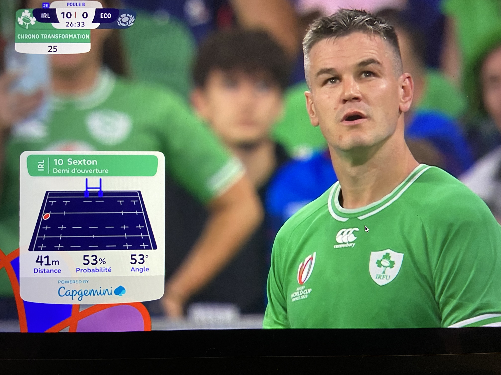
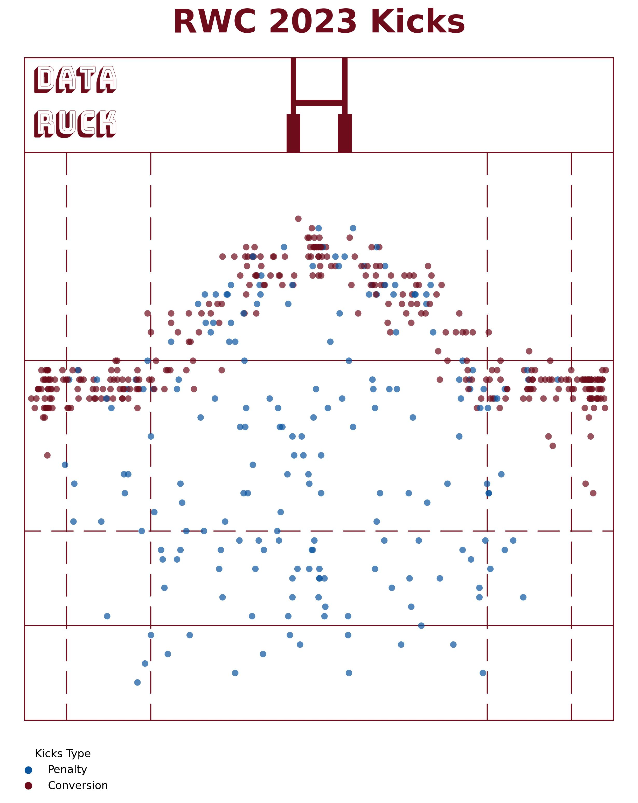
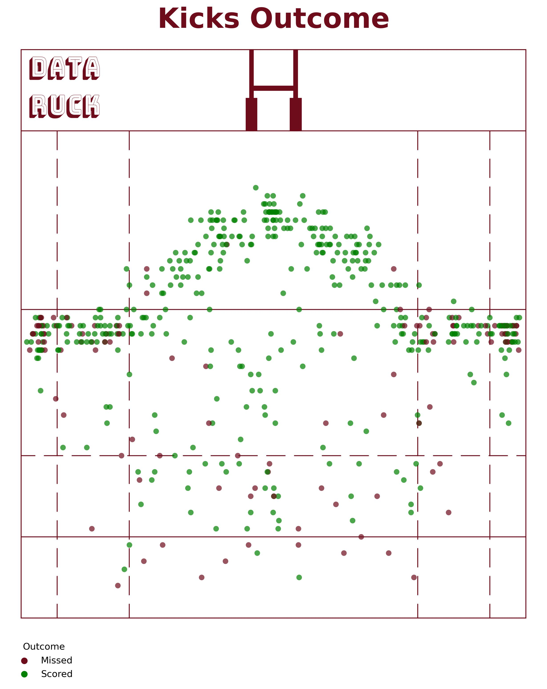
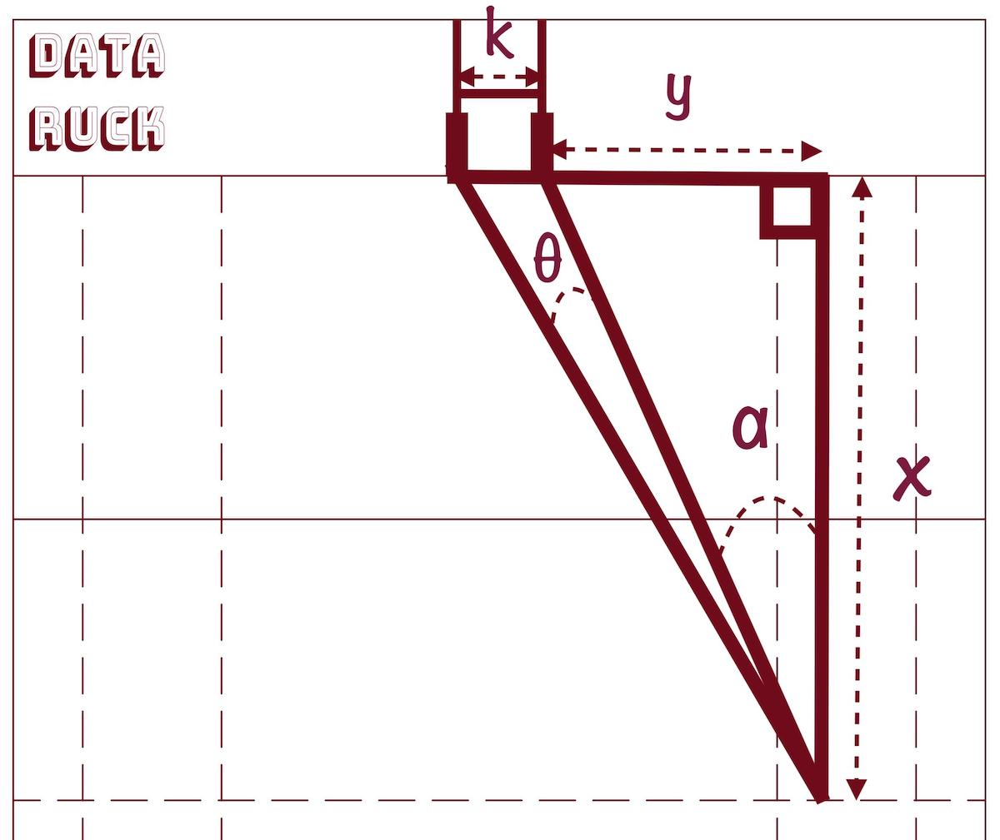
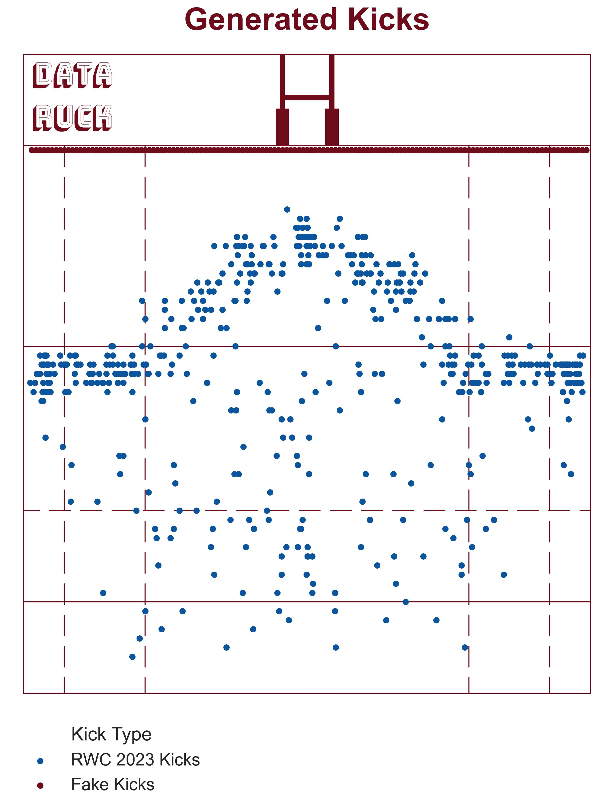
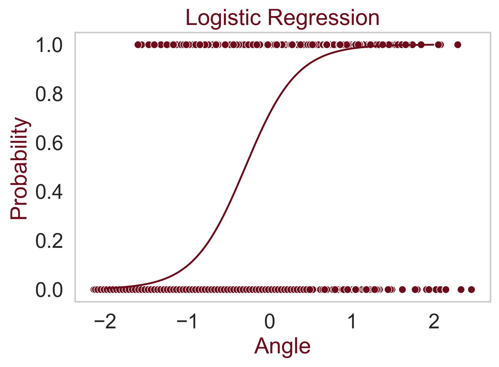
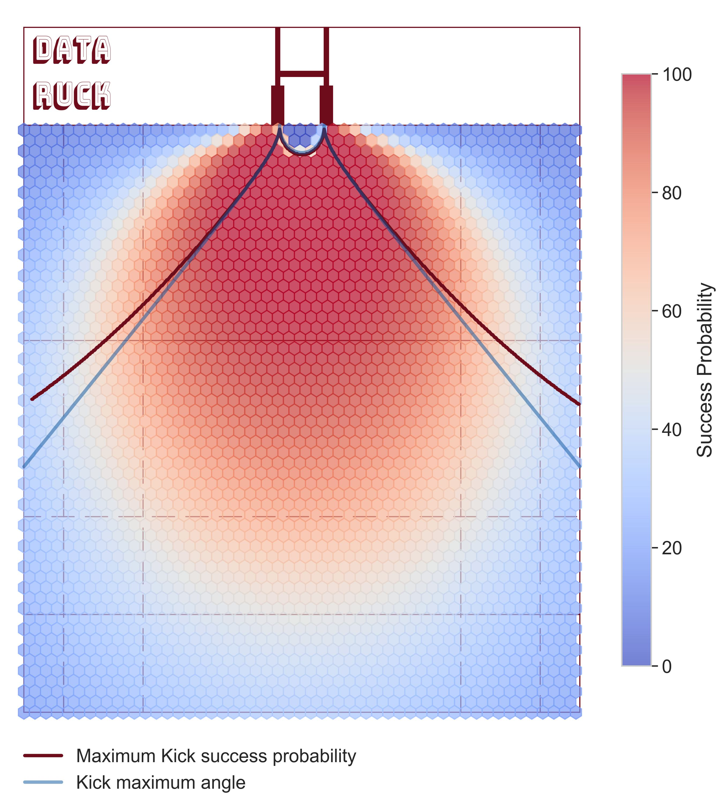

# Rugby World Cup 2023 Kicks probability insight 

If you watched the 2023 Rugby World Cup, you probably noticed the little insight cards that sometimes 
popped up on your tv screen when a player was preparing for a kick. This insight informed us about the 
distance, probability and angle of the kick. 

*Johnny Sexton tossing a coin*

Does Johnny Sexton scored this transformation? You will know at the end of this article. With 53% success probability, 
it is as much likely as getting a tail or head on a coin toss... 

Working as a Data Scientist, this data insights caught my attention and I was quite excited to know 
the probability of success for the kicks (Don't judge! I know I'm a weird data geek...). 
The irrestible desire to compute this probability was building up everytime the insight popped up!
I started to wonder: 
- What data did they use? 
- How did they compute this probability? 
- How much accurate is this prediction? 
- Is France going to win the World Cup?

Good news, we will answer those questions in this article. Bad news, if you are still reading this, you are
probably a weird data geek like me... 

I recommend reading my previous article [Finding the sweet spot that maximizes kick angle](https://www.data-ruck.com/blog/maximizing-kick-angle/) 
before going further, as we will use some results in this article. 

# Exploring 2023 Rugby World Cup Kicks 

We will use the kicks data from 2023 Rugby World Cup. There were:
    - 318 conversions  
    - 197 penalties

Hooray! We have in total 515 kicks that we can use to compute kicks outcome probability. We will also need the outcome of the kicks: 
is the kick missed or not ? Luckily we got that! 
- 64 conversions were missed, about 25%
- 50 penalties were missed about 34% 

Congrats to Argentinian player Emiliano Boffelli who scored the farthest penalty of the world cup (55m) against Wales!

We've got everything we need to start working! Let's goooooo!

# Defining our machine learning problem

Our problem is what we call a **classification problem**: using some features (distance,angle,wind speed...), we want to predict 
one of the two classes: Missed or Scored.

For those that are not familiar with machine learning, a feature is an independant variable that will be used to feed 
a statistical model. If you watch a game, and try to predict the outcome of a kick yourself, It is likely that you take the distance and 
angle as features to take your decision. 

So we will compute the distance from goal posts and angle for every kick in our dataset. 

The formula to compute angle is: $$ \theta(x)   = Arctan(\frac{k+y}{x})-Arctan(\frac{y}{x}) $$ \
The formula to compute distance is: $$ d = \sqrt{x^2+y^2} $$ \
Note that the angle equation is not the same between goal posts. If you want to learn more about those formulas, please read: [Finding the sweet spot that maximizes kick angle](https://www.data-ruck.com/blog/maximizing-kick-angle/) \
For sure, the wind speed and wind direction are important features, but we don't have this information. 

# Generating "fake" data points 

We want to be able to predict the outcome of a kick from every coordinates on the pitch. 
MAYDAY we got a problem! In fact we got two issues: 
- The dataset is unbalanced: we have a lot more Scored kicks (401 kicks) than Missed Kicks (114 kicks). This issue 
can affect our model perfomance as the model will have a poor precision predicting the Missed kicks.
- Some areas on the field don't have any data points we can learn from: Damn no one tried to kick from the goal line... 
So it is likely that our model will predict a success probability > 0 for a kick on the goal line (which is wrong, unless you are 
Antoine Dupont: [Watch Video](https://www.dailymotion.com/video/x8osne7))

In order to tackle those issues, I artificially generated 276 Missed kicks. 
I generated those failed kicks on the goal line and 90 meters away from it (the actual world record is 65.5 meters)
It tackles both issues as the dataset is now balanced, and the model will learn that the probability to score a kick on the 
goal line is close to 0.

# Fitting our model 

The more parameters in the model, the more data you need to train it. Thus it is important to choose a simple model. 
We will use a logistic regression function to predict kicks outcome. \
The logistic function has a S shape and varies between 0 and 1. \
1 is the class for **Scored** kicks\
0 is the class for **Missed** kicks\
Our model is the following:
$$
\begin{aligned}
P_{Scored} = \frac{1}{1+  e^{-(\beta_{angle}\times x_{angle} + \beta_{distance} \times x_{distance} + k)}}
\end{aligned}
$$

with $$P_{Scored}$$ being the probability of success.\
$$x_{angle}$$ is the kick angle\
$$x_{distance}$$ is the kick distance\
$$ k $$ is the intercept 

Fitting our models is the process of searching for the coefficients $$ \beta_{angle}$$, $$\beta_{distance}$$ and $$k$$ that minimizes 
the prediction error. Let's do it!

# Predicting kicks probabilities!

We fitted our model, and here is what we found: 
$$
\begin{aligned}
\beta_{angle}\approx 0.45 \\
\beta_{distance}\approx -0.022 \\
k \approx -1.78

\
\end{aligned}
$$

The larger the angle, the more likely the kick is a success.
The larger the distance, the more likely the kick is missed.

The model has an accuracy of 81%, it means that we successfully predicts a kick outcome 8 times out of 10.
Let's draw the predicted probability on the rugby pitch! 
In my last article, I computed the optimum kick distance that maximizes kick angle. On the 
following figure we see that the maximum probability computed with our model is very close 
to the maximum kick angle line

I computed all the probability gap between the missed conversion and the location on the maximum probability line.
The gap is very low, but at this level every chance to score has to be taken. 

This model has some limitations as it doesn't take into account some variables such as weather condition or the fact that
a player can charge down the kicker. It is still a good insight for team to take a decision wether or not to kick a penalty
based on the probability of success. 

For those who are still reading, yes!! Johnny Sexton scored this transformation. 

Thank you for reading! 