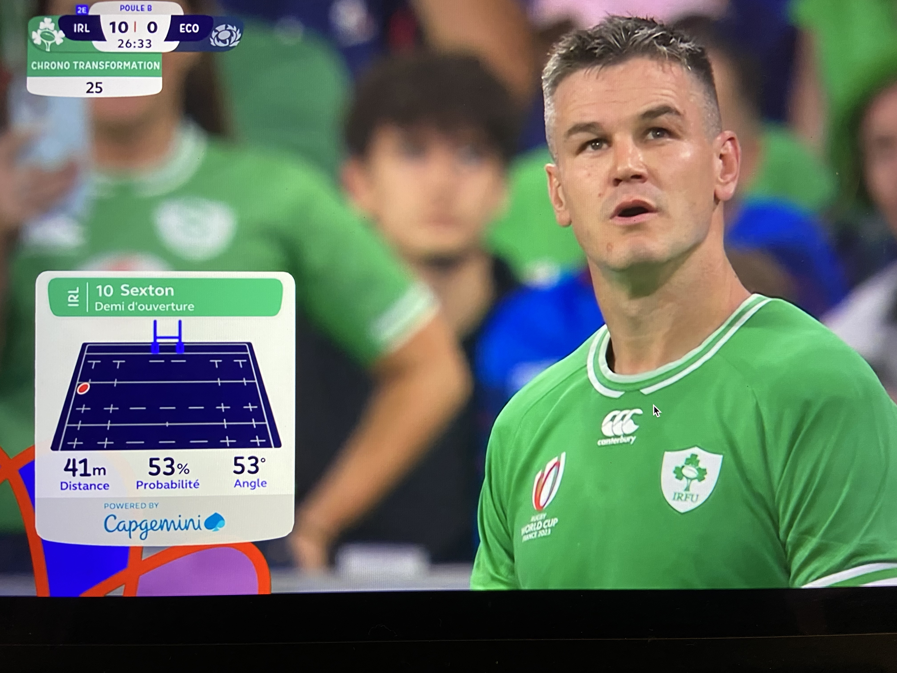
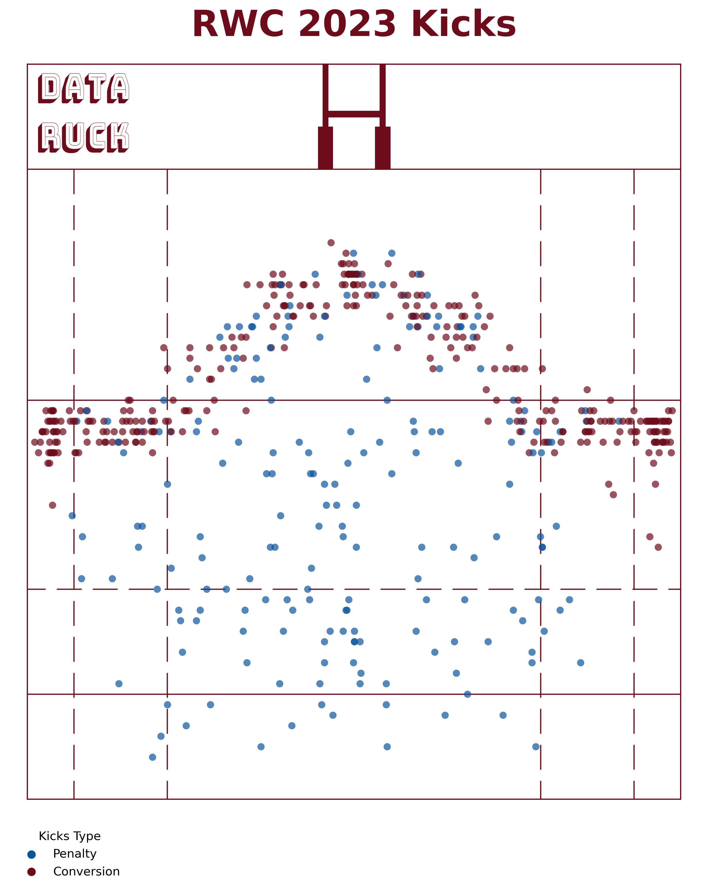
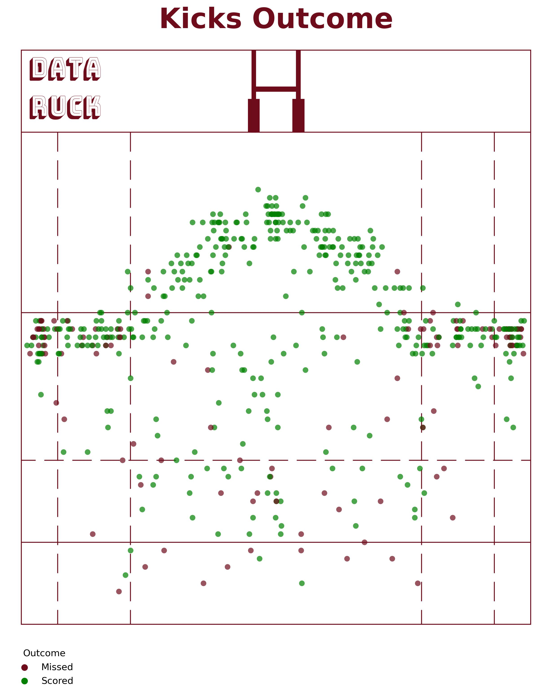
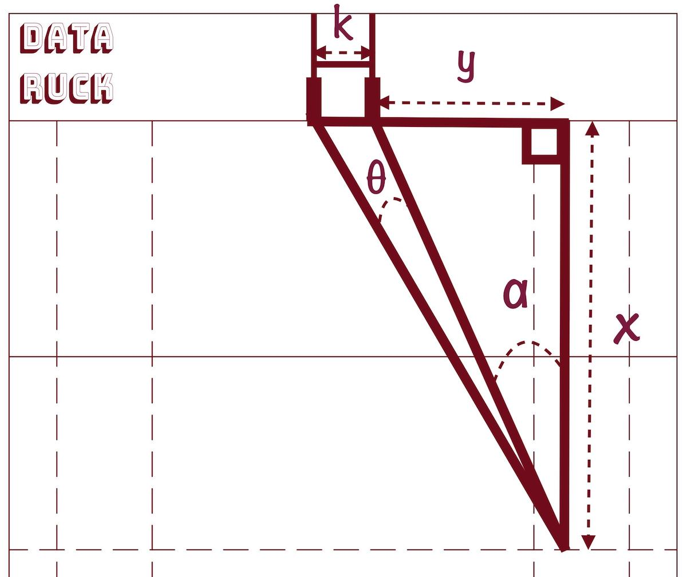
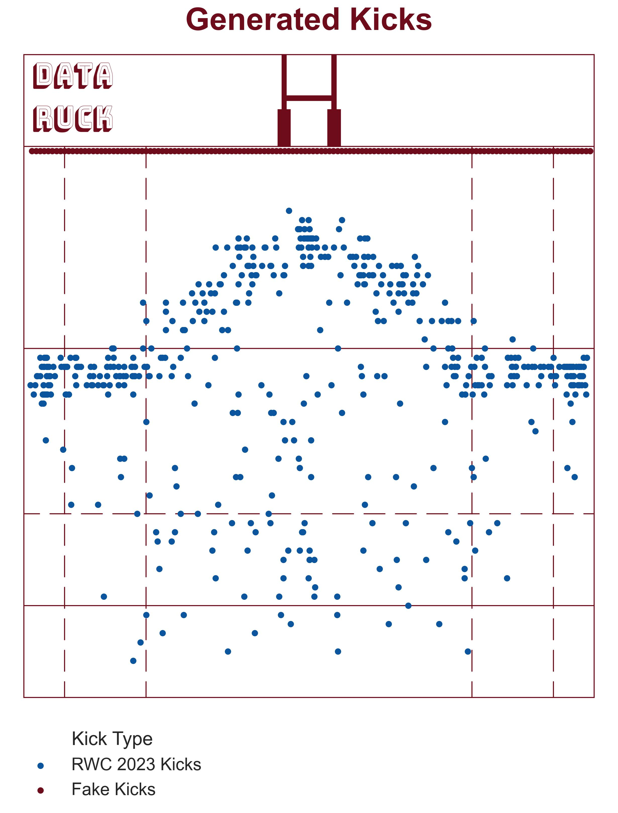
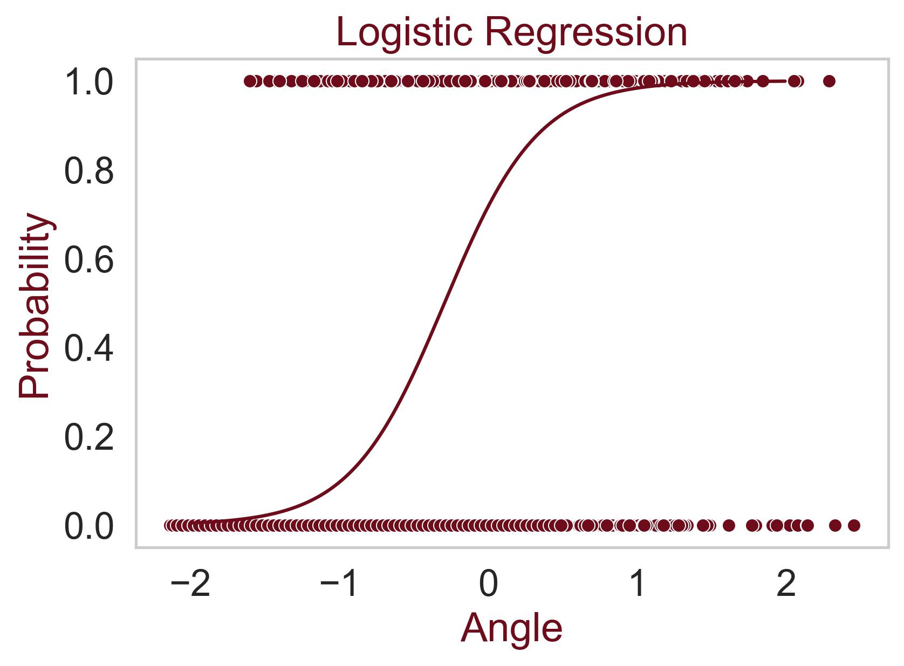
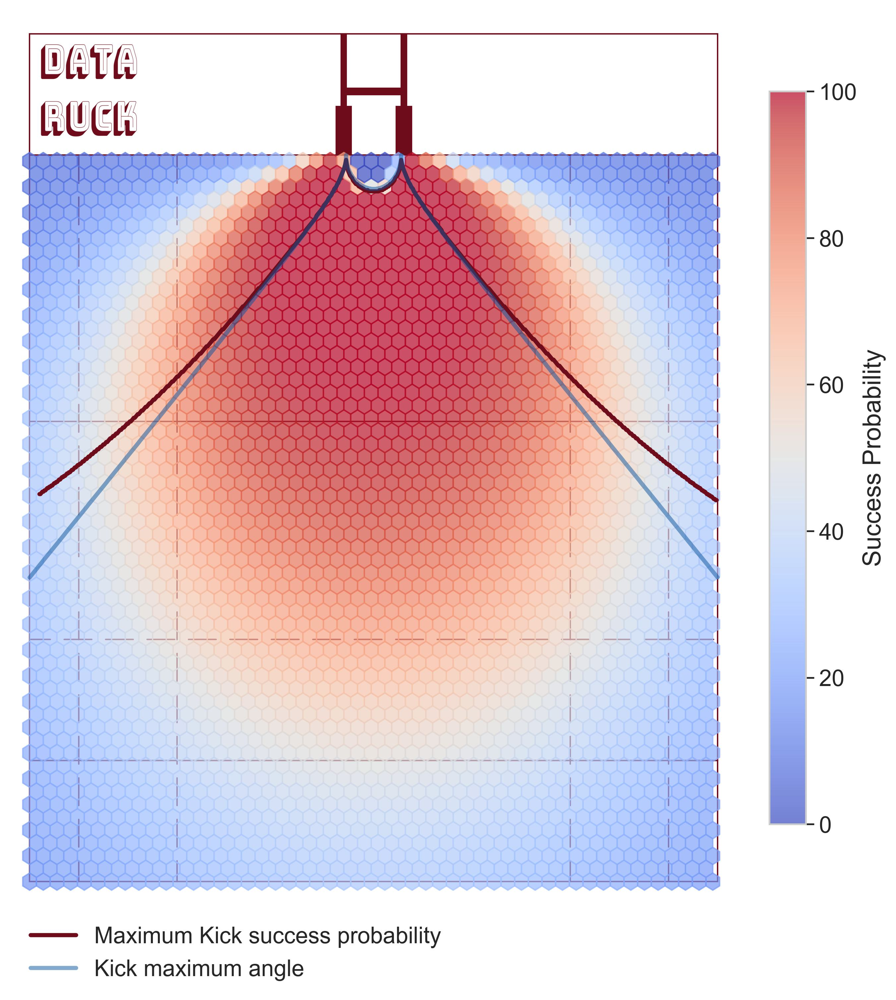

# La probabilité des coups de pied à la Coupe du monde 2023

Si vous avez regardé la Coupe du monde de rugby 2023, vous avez sans doute remarqué les petites
infographies qui apparaissaient parfois à l'écran lorsqu'un joueur se préparait à botter. Ces
encarts nous informaient sur la distance, la probabilité de réussite et l'angle du coup de pied.

*Johnny Sexton lance une pièce*

Johnny Sexton a-t-il réussi cette transformation ? Vous le saurez à la fin de cet article. Avec une
probabilité de réussite de 53 %, c'est à peu près aussi aléatoire que pile ou face...

En tant que Data Scientist, ces infographies ont immédiatement capté mon attention et j'étais
impatient de comprendre comment on calcule une telle probabilité (Ne me jugez pas ! Je sais que
je suis un geek des données un peu bizarre...).
L'envie irrésistible de reproduire ce calcul grandissait à chaque apparition de l'encart !
Je me suis mis à me poser des questions :
- Quelles données ont-ils utilisées ?
- Comment ont-ils calculé cette probabilité ?
- Quelle est la précision de cette prédiction ?
- La France allait-elle gagner la Coupe du monde ?

Bonne nouvelle : nous allons répondre à ces questions dans cet article. Mauvaise nouvelle : si vous
lisez encore, vous êtes probablement un geek des données aussi bizarre que moi...

Je vous recommande de lire mon article précédent [Trouver le point optimal qui maximise l'angle de transformation](https://www.data-ruck.com/blog/maximizing-kick-angle/)
avant de continuer, car nous allons y réutiliser certains résultats.

# Explorer les coups de pied de la Coupe du monde 2023

Nous allons utiliser les données des coups de pied de la Coupe du monde de rugby 2023. On dénombre :
    - 318 transformations
    - 197 pénalités

Parfait ! Nous disposons au total de 515 coups de pied pour estimer la probabilité de réussite. Il
nous faut également connaître le résultat de chaque coup de pied : réussi ou raté ? Bonne nouvelle,
nous avons cette information !
- 64 transformations ratées, soit environ 25 %
- 50 pénalités ratées, soit environ 34 %

Bravo à l'Argentin Emiliano Boffelli qui a inscrit la pénalité la plus lointaine de la compétition
(55 m) face au Pays de Galles !

Nous avons tout ce qu'il nous faut pour commencer. C'est parti !

# Définir notre problème de machine learning

Notre problème est ce qu'on appelle un **problème de classification** : à partir de certaines
variables (distance, angle, vitesse du vent...), nous voulons prédire l'une des deux classes :
Raté ou Réussi.

Pour ceux qui ne sont pas familiers avec le machine learning, une variable (ou *feature*) est une
variable indépendante qui sert à alimenter un modèle statistique. Si vous regardez un match et
essayez de prédire vous-même le résultat d'un coup de pied, vous vous basez probablement sur la
distance et l'angle — ce sont vos *features*.

Nous allons donc calculer la distance aux poteaux et l'angle pour chaque coup de pied du jeu de
données.

La formule pour calculer l'angle est : $$ \theta(x)   = Arctan(\frac{k+y}{x})-Arctan(\frac{y}{x}) $$ \
La formule pour calculer la distance est : $$ d = \sqrt{x^2+y^2} $$ \
L'équation de l'angle diffère lorsque l'essai est marqué entre les poteaux. Pour en savoir plus sur ces formules, lisez : [Trouver le point optimal qui maximise l'angle de transformation](https://www.data-ruck.com/blog/maximizing-kick-angle/) \
La vitesse et la direction du vent sont bien sûr des variables importantes, mais nous ne disposons
pas de cette information.

# Générer des points de données "artificiels"

Nous souhaitons pouvoir prédire le résultat d'un coup de pied depuis n'importe quelle coordonnée
du terrain. Problème ! En réalité, nous en avons deux :
- Le jeu de données est déséquilibré : nous avons beaucoup plus de coups de pied réussis (401)
que ratés (114). Ce déséquilibre peut nuire aux performances du modèle, qui aura du mal à
prédire correctement les coups ratés.
- Certaines zones du terrain ne contiennent aucune donnée : personne n'a botté depuis la ligne
d'en-but... Notre modèle risque donc d'attribuer une probabilité de réussite supérieure à 0 pour
un coup botté sur la ligne d'en-but, ce qui est faux — sauf si vous êtes Antoine Dupont :
[Voir la vidéo](https://www.dailymotion.com/video/x8osne7)

Pour remédier à ces problèmes, j'ai généré artificiellement 276 coups de pied ratés. Ces coups
fictifs ont été placés sur la ligne d'en-but et à 90 mètres de celle-ci (le record du monde réel est
de 65,5 mètres). Cela résout les deux problèmes : le jeu de données est désormais équilibré, et
le modèle apprend que la probabilité de réussite sur la ligne d'en-but est proche de 0.

# Ajuster notre modèle

Plus un modèle contient de paramètres, plus il a besoin de données pour être entraîné. Il est donc
important de choisir un modèle simple. Nous utiliserons une **régression logistique** pour prédire
le résultat des coups de pied. \
La fonction logistique a une forme en S et varie entre 0 et 1. \
1 correspond à la classe **Réussi**\
0 correspond à la classe **Raté**\
Notre modèle est le suivant :
$$
\begin{aligned}
P_{Réussi} = \frac{1}{1+  e^{-(\beta_{angle}\times x_{angle} + \beta_{distance} \times x_{distance} + k)}}
\end{aligned}
$$

avec $$P_{Réussi}$$ la probabilité de réussite.\
$$x_{angle}$$ est l'angle du coup de pied\
$$x_{distance}$$ est la distance du coup de pied\
$$ k $$ est l'intercepte

Ajuster le modèle consiste à rechercher les coefficients $$ \beta_{angle}$$, $$\beta_{distance}$$ et $$k$$ qui minimisent
l'erreur de prédiction. À vos marques !

# Prédire la probabilité des coups de pied !

Après ajustement, voici les coefficients obtenus :
$$
\begin{aligned}
\beta_{angle}\approx 0.45 \\
\beta_{distance}\approx -0.022 \\
k \approx -1.78

\
\end{aligned}
$$

Plus l'angle est grand, plus le coup de pied a de chances d'être réussi.
Plus la distance est grande, plus le coup de pied a de chances d'être raté.

Le modèle atteint une précision de 81 %, ce qui signifie qu'il prédit correctement le résultat
8 fois sur 10. Traçons la probabilité prédite sur le terrain de rugby !
Dans mon article précédent, j'avais calculé la distance optimale de frappe qui maximise l'angle.
Sur la figure ci-dessous, on constate que la probabilité maximale calculée par notre modèle est
très proche de cette ligne de distance optimale.

J'ai calculé l'écart de probabilité entre les transformations ratées et la position sur la ligne de
probabilité maximale. Cet écart est très faible, mais à ce niveau de compétition, chaque
opportunité de marquer doit être saisie.

Ce modèle a ses limites : il ne prend pas en compte des variables comme les conditions
météorologiques ou la possibilité qu'un joueur charge sur le botteur. Il constitue néanmoins une
aide précieuse pour qu'une équipe décide si elle doit tenter une pénalité en fonction de sa
probabilité de réussite.

Pour ceux qui lisent encore : oui !! Johnny Sexton a réussi cette transformation.

Merci d'avoir lu !
