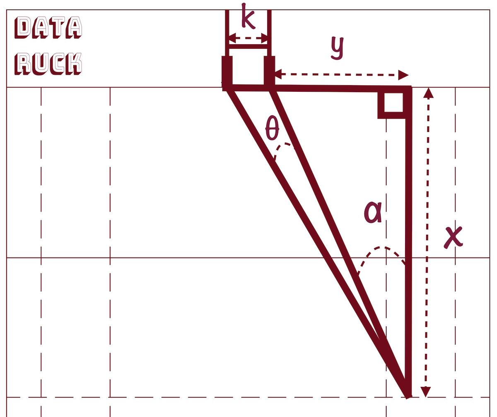
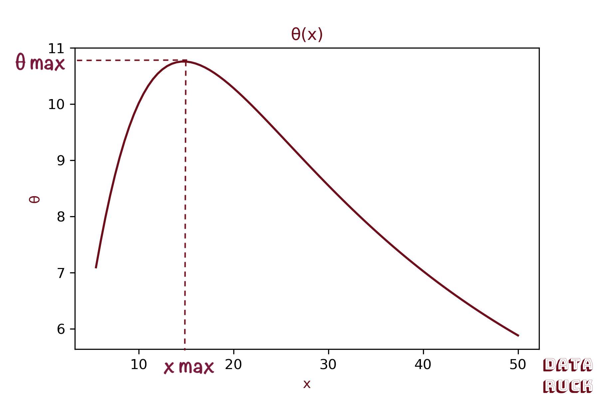
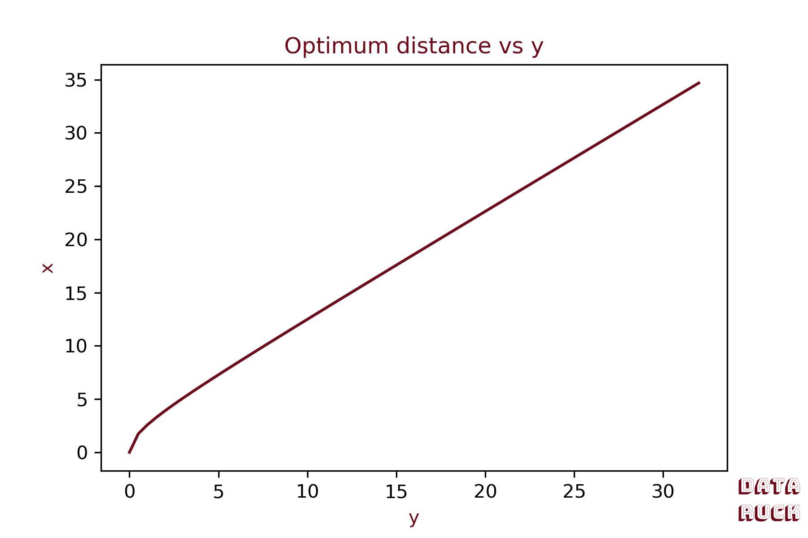
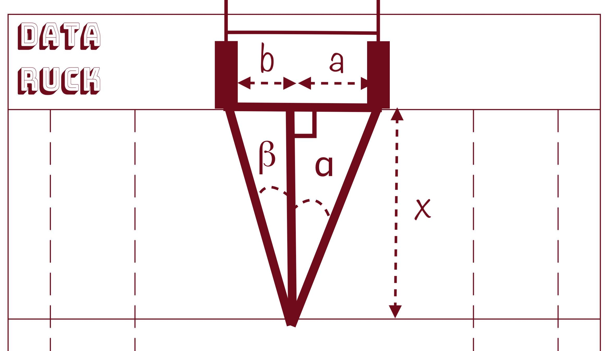
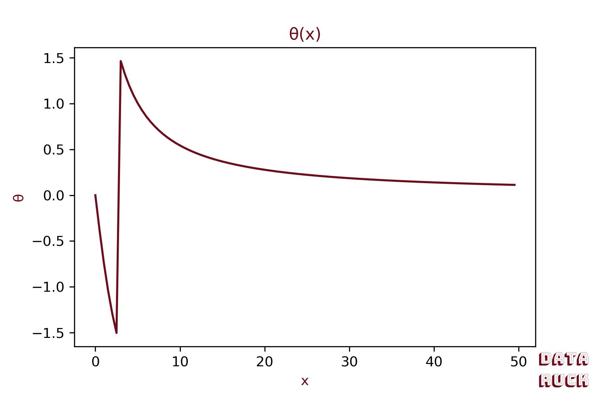
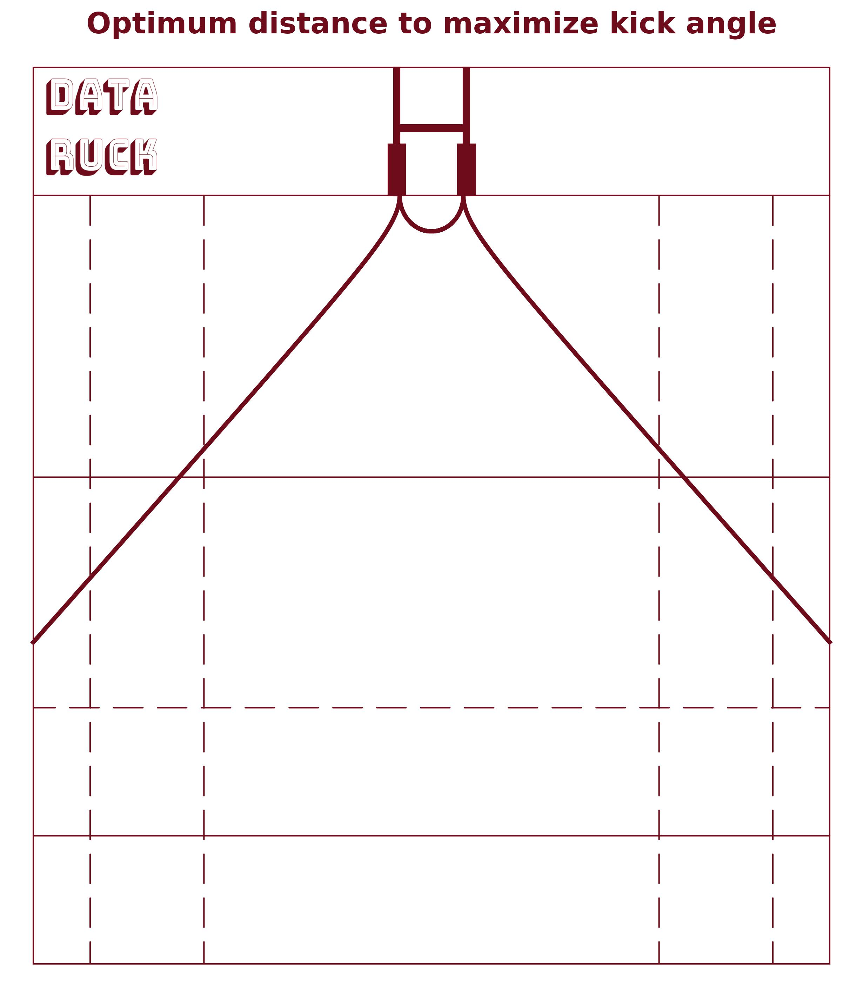
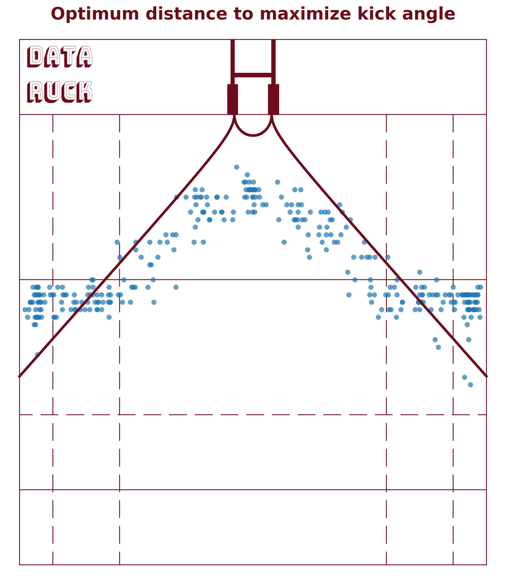

# A simple math problem!

In this first blog post, we go back to mathematics basics: **Trigonometry, derivatives and maximum...**\
Don't leave !!! I swear that it will be fun and applied on rugby!

I had the idea about this article because I wanted to compute the probability of success for a penalty kick 
or a try conversion. I was thinking about the variables that may impact this probability of success: **position on the pitch, distance from crossbar
or angle**.

For thus that are not familiar with rugby rules, when a try is scored it gives that team the right to attempt a conversion. 
The kicker takes the kick in the field of play on a line through the place where the try was awarded, parallel to the touchlines.
How do the kicker chose the distance to take the kick ? This is the question we try to answer below.\

One of the possible answer is: the kicker will takes the kick at the distance that maximizes the angle between him and 
the two goal posts. **The larger the angle, the higher the probability of success!**

Let's draw our problem:
- Y is the distance between the right goal post and the try.
- k is the crossbar length, it is a constant k = 5.6m.
- θ is the angle between the kick and goal posts
- x is the kick distance from goal line.

*Rugby Pitch Figure*

We can formulate our problem as follow: **given the distance Y, we will compute x that maximizes θ.**\
You see it is a simple math problem ! If we remember Trigonometry ...

# Remembering Trigonometry!

Remember sinus, cosinus and tangent? It is time to use those old good friends. 
As we want to find x that maximizes θ, we will write θ as a function of x:

$$
tan(\theta + \alpha) = \frac{k+y}{x} \\[16pt]
\theta + \alpha = Arctan(\frac{k+y}{x}) \\[16pt]
\text{$\theta   = Arctan(\frac{k+y}{x})-\alpha, \:$ with $\: \alpha=tan(\frac{y}{x})$} \\[16pt]
\theta(x)   = Arctan(\frac{k+y}{x})-Arctan(\frac{y}{x})
$$

Let's draw θ(x) for y=50m

*Figure of θ(x)*

We set X max, the distance from crossbar that maximizes the kick angle.
Using Fermat's theorem, we know that θ has a maximum where its derivative equals 0.

# Finding the sweet spot X max! 

We have to compute the derivative $$ \large \frac{\partial \theta}{\partial x} $$ and find x so that $$\large \frac{\partial \theta}{\partial x} = 0$$ \
The derivative of Arctan is:
$$ 
Arctan'(x)=\frac{1}{1+x^2}
$$

The derivative of a composed function $$  \frac{1}{f(x)} $$ is:

$$ 
- \frac{f'(x)}{f(x)^2}
$$

Knowing that we can compute the $$ \theta(x) $$ derivative:

$$
\frac{\partial \theta}{\partial x} = - \frac{(k+y)}{x^2}\times\frac{1}{1+(\frac{k+y}{x})^2} + \frac{y}{x^2}\times\frac{1}{1+\frac{y^2}{x^2}} \\[16pt]
\Rightarrow \frac{\partial \theta}{\partial x} =  - \frac{(k+y)}{x^2+(k+y)^2}+\frac{y}{x^2+y^2} \\[16pt]
\Rightarrow \frac{\partial \theta}{\partial x} = \frac{y}{x^2+y^2} - \frac{k+y}{x^2+k^2+2yk+y^2} \\[16pt]
\Rightarrow \frac{\partial \theta}{\partial x} = \frac{yx^2+yk^2+2y^2k+y^3+-kx^2-ky^2-yx^2-y^3}{(x^2+y^2) \times (x^2+k^2+2yk+y^2)} \\[16pt]
\Rightarrow  \frac{\partial \theta}{\partial x} = \frac{yk^2+ky^2-kx^2}{(x^2+y^2) \times (x^2+k^2+2yk+y^2)}
$$

We now have to find x so that  $$\large \frac{\partial \theta}{\partial x} = 0$$

$$
\begin{aligned}
\frac{\partial \theta}{\partial x} = 0 \\[16pt]
\Rightarrow kx^2 = yk^2 + ky^2 \\[16pt] 
\Rightarrow  x^2 = yk + y^2 \\[16pt]
\Rightarrow  x_{max} = \sqrt{y^2 + yk}

\end{aligned}
$$

Hooray! we just found the sweet spot equation! For a try located at 10m from the right goal post, the 
distance that maximizes the kick angle is: 

$$ 
\begin{aligned}
x_{max} = \sqrt{10^2 + 10\times5.6} = 12.5m 
\end{aligned}
$$

Let's draw the sweet spot distance vs y: 

*X Max vs y*

This equation is true when the try is located on the right or left of the goal posts. It differs when the try is scored
between the goal posts.

Let's compute the angle equation for this case:

*Rugby Pitch math when try between goal posts*

We have: 

$$
\begin{aligned}
k = a+b = 5.6m \\
\theta = \alpha + \beta \\[16pt]
tan(\theta) = \frac{tan(\alpha)+tan(\beta)}{1-tan(\alpha)\times tan(\beta)} \\[16pt]
\Rightarrow tan(\theta) = \frac{\frac{a}{x}+\frac{b}{x}}{1-\frac{ab}{x^2}} \\[16pt]
\Rightarrow tan(\theta) = \frac{kx}{x^2-ab} \\[16pt]
\Rightarrow \theta = Arctan(\frac{kx}{x^2-ab})
\end{aligned}
$$

This function is not defined for $$ x=\sqrt(ab) $$ as the denominator would be 0. 
Let's draw it for a=2m:

*Figure of θ(x)*

The function tends to 90 degrees when x tend to $$ \sqrt(ab)$$ from the right side.
Enough calculus, let's put everything together and plot the sweet spots on the pitch ! 

# A good fit 

I computed X max for every y point (from 0 to 70m as a rugby pitch width is 70m). Here is the result: 

*Figure of the optimal distance that maximizes angle*

Of course the angle is not the only variable to take into account. When the try is scored between 
the two goal posts, the optimum distance that we computed seems to be too small. Players take into consideration 
the height of the cross bar (3m) and also the distance to the goal line.

It would be interesting to know how players place themselves to kick a conversion or a penalty... 
Do they have the equation we computed in mind ? 
Here are all the conversions that were kicked during 2023 Rugby World cup. Without any surprise, 
we see that players choose the distance kick close to the optimum distance we computed !

*Rugby world cup 2023 conversion coordinates* 

This first article was a good warm up! In the following article, we will continue diving into 
the science of rugby kicks: we will try to build a model predicting success probability based on kicks 
coordinates! 

Thank you for reading! 
