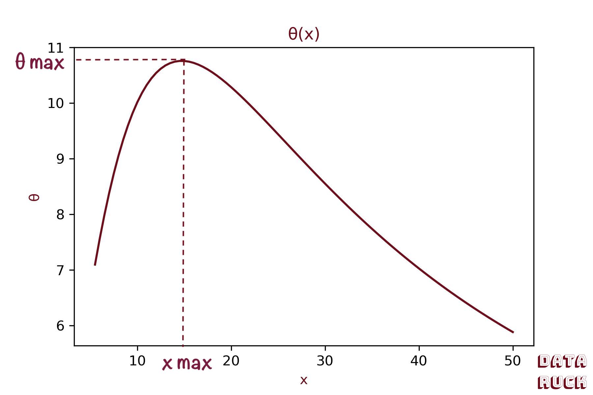
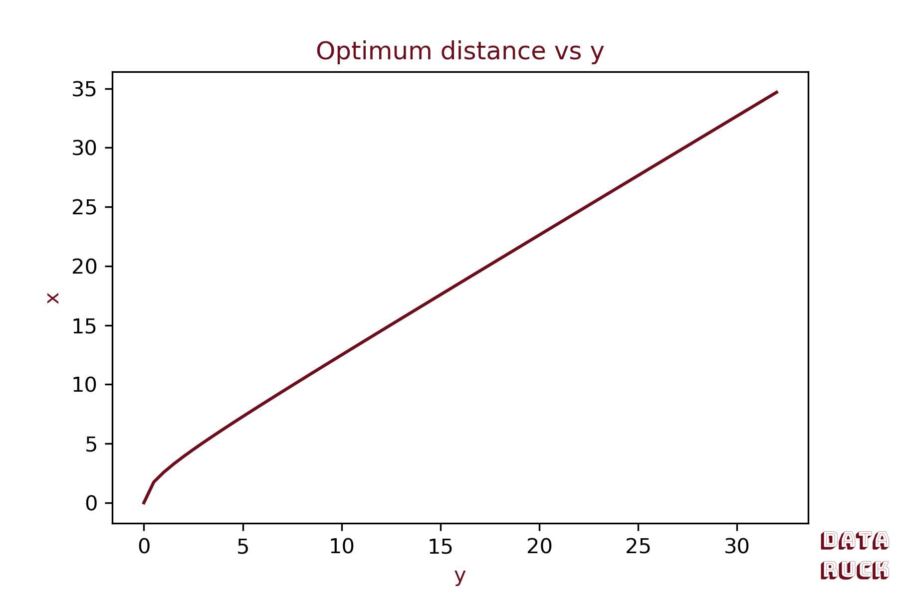
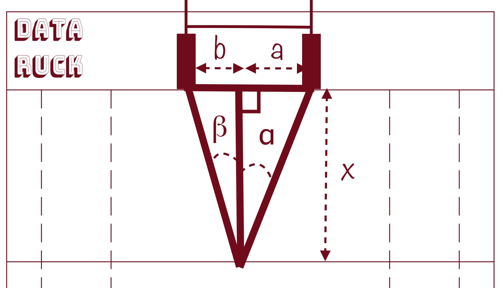
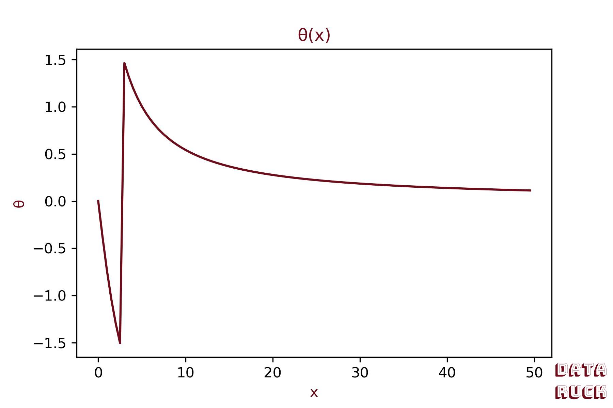
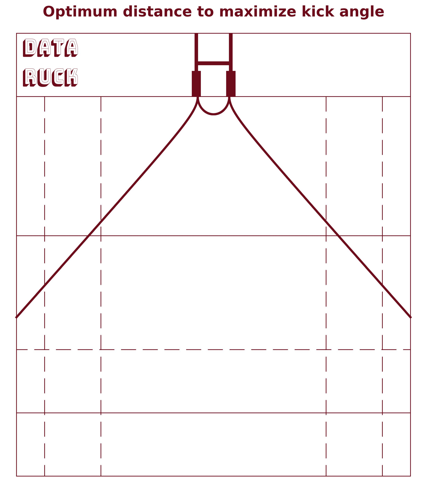
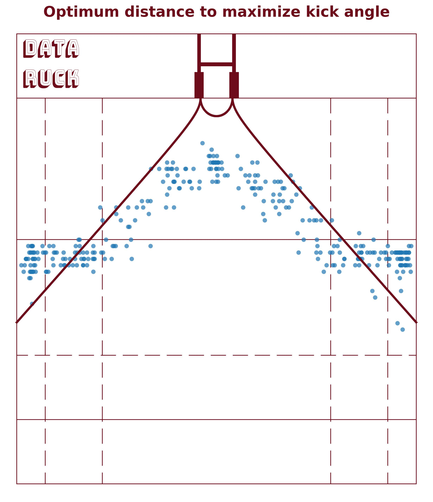

# A simple maths problem!

In this first blog post, we go back to basics: **trigonometry, derivatives and maxima…**
Don't leave! I promise it'll be fun — and very much applied to rugby.

I had the idea for this article while thinking about how to calculate the probability of a successful penalty or conversion. I was considering the variables that could influence that probability: **field position, distance to the crossbar, and angle**.

For those who don't know the rules of rugby well: when a try is scored, the attacking team earns a conversion attempt. The kicker places the ball on a line parallel to the touchlines, running through the point where the try was grounded.
So how does the kicker choose how far back to stand? That's the question we're trying to answer here.

One natural answer is: the kicker stands at the distance that **maximises the angle between him and the two posts**. The wider the angle, the higher the probability of success.

Let's set up the problem:
- Y is the distance between the right post and the point where the try was scored.
- k is the width of the crossbar, a constant equal to k = 5.6 m.
- θ is the angle between the kicker and the posts.
- x is the kicking distance from the try line.

*Rugby pitch diagram*

We can frame the problem as: **given the distance Y, find x that maximises θ.**
See? Simple maths — if you remember your trigonometry…

# Back to trigonometry!

Remember sine, cosine and tangent? Time to dust off those old friends.
Since we want to find the x that maximises θ, we express θ as a function of x:

$$
tan(\theta + \alpha) = \frac{k+y}{x} \\[16pt]
\theta + \alpha = Arctan(\frac{k+y}{x}) \\[16pt]
\text{$\theta   = Arctan(\frac{k+y}{x})-\alpha, \:$ with $\: \alpha=tan(\frac{y}{x})$} \\[16pt]
\theta(x)   = Arctan(\frac{k+y}{x})-Arctan(\frac{y}{x})
$$

Plotting θ(x) for y = 50 m:

*Plot of θ(x)*

We call X max the distance from the try line that maximises the kicking angle.
By Fermat's theorem, θ reaches its maximum where its derivative is zero.

# Finding the optimal point X max!

We need to compute the derivative $$ \large \frac{\partial \theta}{\partial x} $$ and find x such that $$\large \frac{\partial \theta}{\partial x} = 0$$. \
The derivative of Arctan is:
$$ 
Arctan'(x)=\frac{1}{1+x^2}
$$

The derivative of a composite function $$  \frac{1}{f(x)} $$ is:

$$ 
- \frac{f'(x)}{f(x)^2}
$$

We can therefore compute the derivative of $$ \theta(x) $$:

$$
\frac{\partial \theta}{\partial x} = - \frac{(k+y)}{x^2}\times\frac{1}{1+(\frac{k+y}{x})^2} + \frac{y}{x^2}\times\frac{1}{1+\frac{y^2}{x^2}} \\[16pt]
\Rightarrow \frac{\partial \theta}{\partial x} =  - \frac{(k+y)}{x^2+(k+y)^2}+\frac{y}{x^2+y^2} \\[16pt]
\Rightarrow \frac{\partial \theta}{\partial x} = \frac{y}{x^2+y^2} - \frac{k+y}{x^2+k^2+2yk+y^2} \\[16pt]
\Rightarrow \frac{\partial \theta}{\partial x} = \frac{yx^2+yk^2+2y^2k+y^3+-kx^2-ky^2-yx^2-y^3}{(x^2+y^2) \times (x^2+k^2+2yk+y^2)} \\[16pt]
\Rightarrow  \frac{\partial \theta}{\partial x} = \frac{yk^2+ky^2-kx^2}{(x^2+y^2) \times (x^2+k^2+2yk+y^2)}
$$

Now we look for x such that $$\large \frac{\partial \theta}{\partial x} = 0$$:

$$
\begin{aligned}
\frac{\partial \theta}{\partial x} = 0 \\[16pt]
\Rightarrow kx^2 = yk^2 + ky^2 \\[16pt] 
\Rightarrow  x^2 = yk + y^2 \\[16pt]
\Rightarrow  x_{max} = \sqrt{y^2 + yk}

\end{aligned}
$$

We've found the formula for the optimal point! For a try scored 10 m from the right post, the distance that maximises the angle is:

$$ 
\begin{aligned}
x_{max} = \sqrt{10^2 + 10\times5.6} = 12.5\text{ m}
\end{aligned}
$$

Plotting the optimal distance as a function of y:

*X Max as a function of y*

This equation holds when the try is scored to the right or left of the posts. It differs when the try is scored between the posts.

Let's derive the angle equation for that case:

*Mathematical diagram when the try is scored between the posts*

We have:

$$
\begin{aligned}
k = a+b = 5.6\text{ m} \\
\theta = \alpha + \beta \\[16pt]
tan(\theta) = \frac{tan(\alpha)+tan(\beta)}{1-tan(\alpha)\times tan(\beta)} \\[16pt]
\Rightarrow tan(\theta) = \frac{\frac{a}{x}+\frac{b}{x}}{1-\frac{ab}{x^2}} \\[16pt]
\Rightarrow tan(\theta) = \frac{kx}{x^2-ab} \\[16pt]
\Rightarrow \theta = Arctan(\frac{kx}{x^2-ab})
\end{aligned}
$$

This function is undefined at $$ x=\sqrt(ab) $$ since the denominator would be zero.
Plotting it for a = 2 m:

*Plot of θ(x)*

The function tends to 90 degrees as x approaches $$ \sqrt(ab)$$ from the right.
Enough calculations — let's put it all together and plot the optimal points on the pitch!

# A convincing result

I computed X max for each value of y (from 0 to 70 m, the width of a rugby pitch). Here's the result:

*Optimal distance maximising the kick angle*

Of course, angle is not the only factor. When the try is scored between the posts, the optimal distance computed here looks a little short — players also account for the height of the crossbar (3 m) and their distance from the try line.

It would be interesting to see where players actually stand for conversions and penalties…
Do they have the formula in their heads?
Here are all the conversions kicked at the 2023 Rugby World Cup. Unsurprisingly, players choose a kicking distance very close to the calculated optimum!

*Conversion coordinates from the 2023 Rugby World Cup*

This article was a good warm-up! In the next one, we'll keep exploring the science of kicking in rugby — building a model to predict the probability of a successful kick from its coordinates on the pitch.

Thanks for reading!
