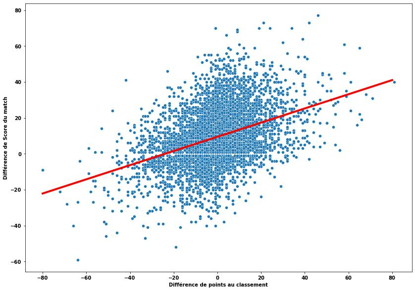
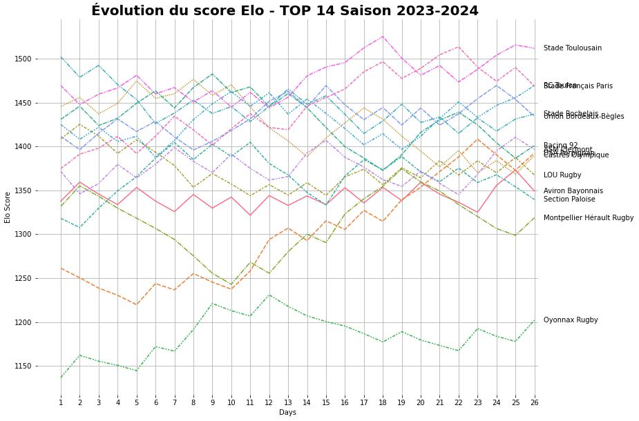
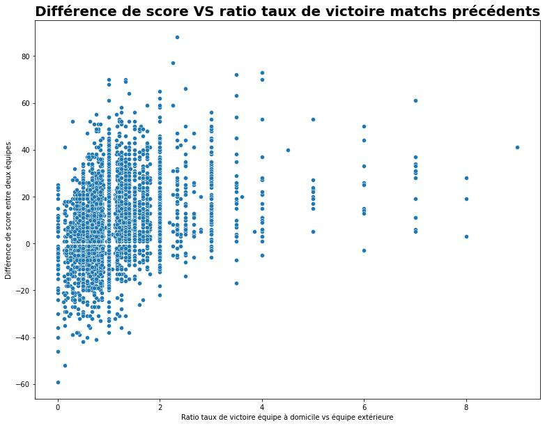
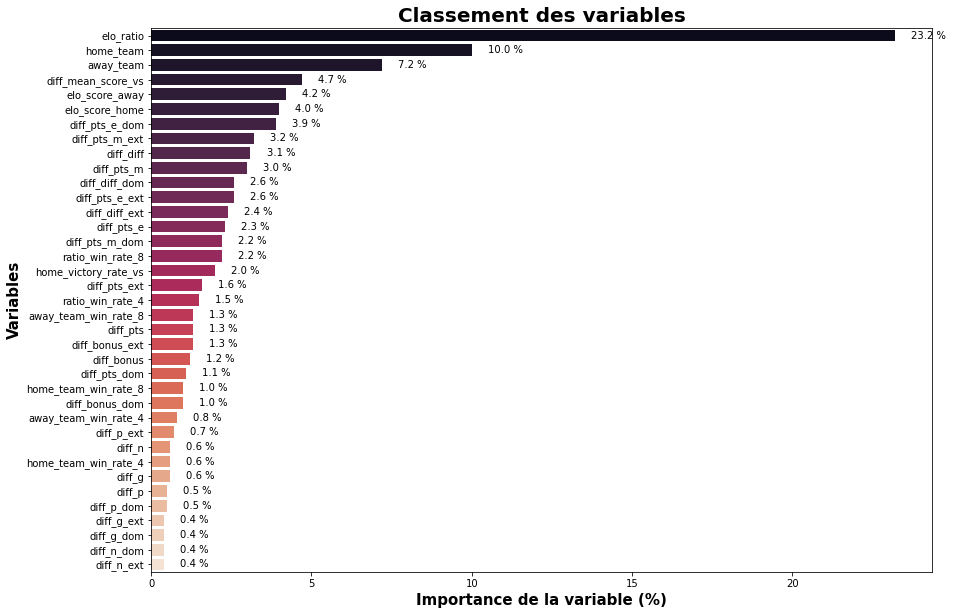
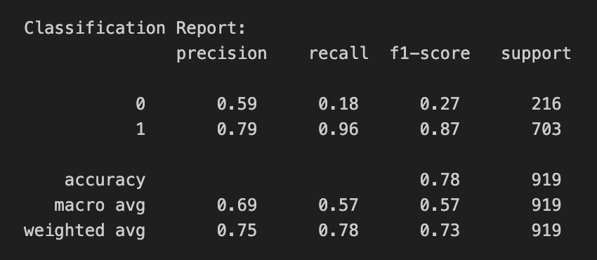

# Devenir un(e) maestro des pronos 

Emporté par la ferveur du supporter, il m'arrive souvent de donner mon équipe favorite gagnante. Et mon pronostic 
s'avère la plupart du temps faux... Alors je me suis posé les questions suivantes: Est-il possible d'avoir un pronostic
plus objectif ? Quelle est la probabilité que mon équipe favorite gagne ? Et quels sont les facteurs qui font qu'une équipe 
est donnée gagnante ?

Si tu as lu mon article précédent, tu sais que jouer à domicile en TOP 14 ou en PRO D2 donne un avantage non négligeable. Si tu ne l'as pas encore lu, c'est par
[ici](https://www.data-ruck.com/blog/rugby-home-advantages/) 👈

Dans cet article, je vais présenter ma méthodologie pour créer un modèle de machine learning et évaluer sa performance pour prédire les résultats des matchs !\
Pour cela nous allons aborder les sujets suivants:
1. Les datas à disposition pour entraîner le modèle
2. Créer un modèle de référence à battre
3. Créer de nouvelles variables 
4. Sélectionner les variables les plus pertinentes
5. Les limites de l'analyse

Alors si tu en as marre de faire des pronos au doigt mouillé, cet article est pour toi ! 

# 1. Les datas à disposition pour entraîner le modèle

Pour prendre une décision, il nous faut des informations ! Et oui, les datas c'est le nerf de la guerre, plus on 
a de datas, plus on a d'informations et plus on sera capable de modèliser un phénomène grâce à ces informations. 

Ici le phénomène que l'on doit modéliser, c'est le résultat d'un match de rugby entre deux équipes. Pour cela nous disposons de l'historique des résultats, classements et statistiques de matchs de PRO D2 ET TOP 14.\
Voici la répartition de résultats des matchs des équipes à domicile:
- 73% de victoires
- 23% de défaites
- 4% de matchs nuls

Le nombre de matchs ex-aeqo étant faible et donc difficile à prédire, nous allons nous concentrer 
sur les matchs avec une victoire ou une défaite. En enlevant les matchs nuls, le pourcentage de victoires à domicile 
est de **75%**.

# 2. Un modèle de référence

Pour créer et évaluer un modèle, nous devons d'abord définir une mesure de performance du modèle ainsi qu'une mesure 
de référence. En effet, comment savoir si notre modèle est bon si nous n'avons pas d'élèment de comparaison ?\
Notre mesure de performance sera l'accuracy: le % de prédiction correct du modèle (la ratio de victoires/défaites correctement
prédites sur le total de matchs). 

**1er modèle de référence: un modèle pas très objectif...**

Et si notre modèle de référence prédisait la victoire systèmatique de l'équipe à domicile, quel serait son accuracy ? 

Si vous avez suivi, l'accuracy de ce modèle est de ... **75%**. En effet, on a vu plus haut que les équipes à 
domicile gagnent 75% de leur matchs ! 
Cela signifie que le modèle que l'on va créer devra avoir une accuracy de plus de 75%.
Ce modèle n'est pas très performant car il est par construction incapable de prédire une défaite
de l'équipe à domicile.

**2eme modèle de référence: un modèle un peu plus intelligent**

Essayons d'être un peu plus malin.... Nous pourrions utiliser la différence de points au classement du championnant à la date 
du match pour prédire le résultat. L'hypothése est qu'une équipe qui a plus de points au classement a plus de chance de gagner 
contre une équipe qui est moins bien classée. Regardons ce que ça donne: 

*Différence de score en fonction de la différence de points au classement avant le match*

Notre hypothése est bonne, plus la différence de points au classement est grande, plus la différence de score est grande ! 
On peut modéliser la relation entre ces deux variables avec une régression linéaire (droite rouge sur le graphique ci-dessus) et 
on obtient ansi la formule suivante: 

$$ 
\begin{aligned}
Différence_{Score} = Différence_{Points}\times0.4 + 9.4
\end{aligned}
$$

***Petit exemple***: Le Stade Toulousain (76 points avant le match) reçoit la Rochelle (66 points avant le match), notre régression 
linéaire prédit une victoire du stade toulousain de 13 points: 

$$ 
\begin{aligned}
13.4 = 10\times0.4 + 9.4
\end{aligned}
$$

***Fun fact***: on remarque qu'avec un nombre de points au classement égal entre les deux équipes, l'équipe qui reçoit a un avantage de 9.4 points 
d'avance sur l'équipe adverse.\
On peut utiliser ce modèle pour prédire le résultat d'un match:
- Si la différence de score est > 0, l'équipe à domicile gagne. 
- Si la différence de score est < 0, l'équipe à domicile perd. 

Avec ce modèle, on obtient une accuracy légèrement supérieure au modèle précédent: **76%**.\
Ce modèle est facilement améliorable: il n'est pas bon pour prédire les premiers matchs de championnats car les différences de points au classement ne reflétent 
pas le niveau des équipes. 

# 3. Créer de nouvelles variables 

L'objectif de cette partie est de trouver et construire de nouvelles variables qui seront utiles pour le modèle 
afin de prédire le résultat d'un match. Avez-vous des idées ? 

Voici les variables qui me viennent en tête et qui je pense peuvent aider le modèle à prendre les bonnes décisions:
- Taux de victoires sur différentes périodes: 1, 3, 6... derniers matchs
- Taux de victoires à domicile et à l'extérieur
- Taux de victoires contre l'équipe adverse 
- Nombre de points moyens marqués/encaissés contre l'équipe adverse 
- Score ELO 

Une technique que je vais également utiliser consiste à encoder les variables catégorielles (par exemple le nom des équipes) à
partir du résultat des matchs, concrétement on peut remplacer le nom des équipes par la moyenne de matchs gagnés. 

## Score ELO

Comme dit précédemment, le classement ne permet pas d'avoir une bonne indication du niveau 
des équipes, notamment durant les premières journées de championat. Nous allons donc calculer un **score ELO**.
Le score ELO a été inventé par le physicien Arpad Elo pour évaluer le niveau des joueurs d'échecs mais il est maintenant 
utilisé dans différents sports comme le football ou le esport pour quantifier le niveau d'une équipe. Le score ELO est un score relatif dont la logique est assez simple:
- Plus une équipe est performante, plus son score ELO est élevé. 
- Si une équipe avec un score ELO bien plus élevé que l'équipe adverse gagne le match, elle recevra peu de points 
et l'équipe adverse plus faible perdra peu de points.
- Au contraire, si une équipe avec un score ELO bien plus élevé que l'équipe adverse perd le match, elle sera pénalisée 
d'un grand nombre de points et l'équipe plus faible sera récompensée proportionellement. 

Pour les plus téméraires, j'ai mis la formule en annexe à la fin de l'article.
Voila le résultat sur la saison 2023-2024: 

*Evolution du score Elo en TOP 14 saison 2023-2024*

## Taux de victoire

Le taux de victoire est également une variable qui me semble importante à calculer. 
Une de mes hypothéses est que la ratio entre le taux de victoire (sur les x matchs précédents) de l'équipe à domicile et 
le taux de victoire de l'équipe à l'extérieure est corrélée avec la différence de score. 

Bingo ! Mon hypothèse est valide, il y a bien une corrélation (coefficient de pearson de 0.33) entre ce ratio et la 
différence de score: 

*Différence de score VS Ratio taux de victoire 
des deux équipes sur les matchs précédents*

Mais combien de matchs précédents doit on prendre en compte dans le calcul pour avoir un 
taux de victoire représentatif ? 2 matchs, 4 matchs, x matchs.
Pour y répondre, j'ai calculé la corrélation entre la différence de score et le taux de victoire avec différentes 
fenêtres de calculs et voici le résultat: 

*Corrélation entre différence de score et taux de victoire de l'équipe extérieure
pour différentes fenêtres de calculs*

Le coude de la courbe se situe aux alentours d'une dizaine de match avec une corrélation avoisinant 
les -0.25 (plus l'équipe à l'extérieure à un taux de victoire important, plus la différence de score domicile 
vs extérieure sera faible)

# 4. Sélectionner les variables les plus pertinentes

Une fois que nous avons créé ces nouvelles variables, il est temps de sélectionner celles qui sont 
les plus importantes. Pour faire cela, l'idée est d'entrainer un modèle 
à prédire le résultat des matchs et regarder les variables qui apportent le plus d'informations.

Je ne vais pas entrer dans le détail mais si cela vous intéresse: j'ai utilisé un modèle random forest 
car il fournit des informations sur l'importance des variables après l'entrainement. 

Voici le classement des variables en fonction de leur importance: 

*Importance des variables*

Comme vous pouvez le voir, les variables qui apportent le plus d'information au modèle sont: 
- elo_ratio: le ratio des scores Elo des deux équipes 
- home_team: équipe à domicile encodée (moyenne de matchs gagnés)
- away_team: équipe à l'extérieure encodée (moyenne de matchs gagnés)
- diff_mean_score_vs: la différence de score moyenne lors des dernières confrontations
- elo_score_home: score Elo de l'équipe à domicile 
- elo_score_away: score Elo de l'équipe extèrieure 

En entrainant le random forest sur ces variables, j'obtiens une accuracy de **78%**. 
En créant de nouvelles variables (= gain d'information), nous arrivons petit à petit 
à réduire l'incertitude.

*Rapport d'évaluation du modèle*

Le modèle est moins bon pour prédire la défaite de l'équipe à domicile: 
celui-ci réussi a bien catégoriser seulement 20% des matchs perdus 
par celle-ci (recall ci-dessus).

# 5. Les limites de l'analyse

Et voila, c'est terminé les pronostics au doigt mouillé ! Cette analyse qui s'appuie 
sur les données et du machine learning nous permet d'avoir une vision plus objective de l'issu d'un match. 
Cependant, il ne faut pas oublier que cette méthode est imparfaite et qu'elle ne prend 
pas en compte de nombreux paramètres: météo, composition des équipes. Au final, 
ces pronostics donnent des pistes, mais le rugby garde toute sa magie grâce à l’imprévisible, et c'est pourquoi
on aime ce sport !

Voici mon pronostic pour la Journée 13 entre le Stade Montois et Grenoble: 

*Pronostics PRO D2 Stade Montois - Grenoble*

Je partage ces pronostics avant chaque journée de TOP 14 et PRO D2 sur mon compte twitter [ici](https://x.com/DataRuck) 👈 ou sur
ma page instagram [ici](https://www.instagram.com/data_ruck/) 👈. 
Si vous avez aimé l'article, n'hésitez pas à me follow ! 

## Annexes

### Score ELO
Pour chaque équipe, le score se calcule en deux temps:
1. Calcul de la probabilité de gagner:
$$
\begin{aligned}
P_{teamA}=\frac{1}{1+10^\frac{Elo_{teamB}-Elo_{teamA}}{400}}\\
\end{aligned}
$$

2. Mise à jour du rating en fonction du résultat du match 
$$
\begin{aligned}
NewElo{teamA} = OldElo_{teamA} + K \times (GameOutcome-P_{teamA})
\end{aligned}
$$
Avec $$GameOutcome=1$$ si team A gagne, $$GameOutcome=0.5$$ si égalité et $$GameOutcome=0$$ si elle perd. 

