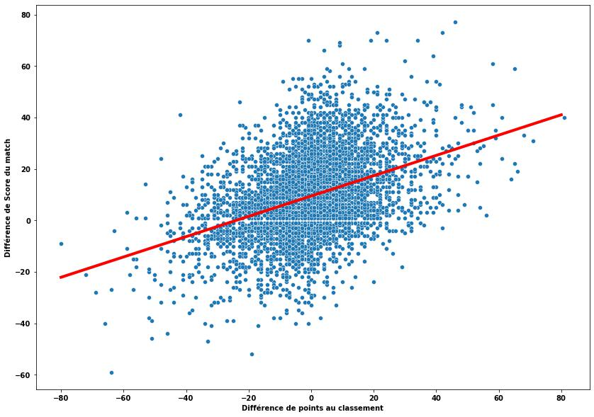
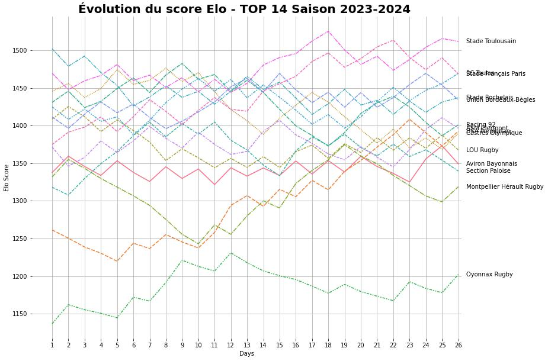
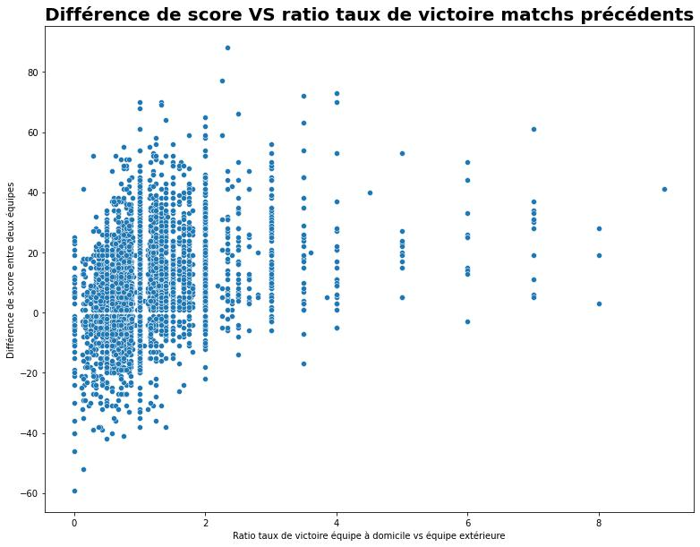
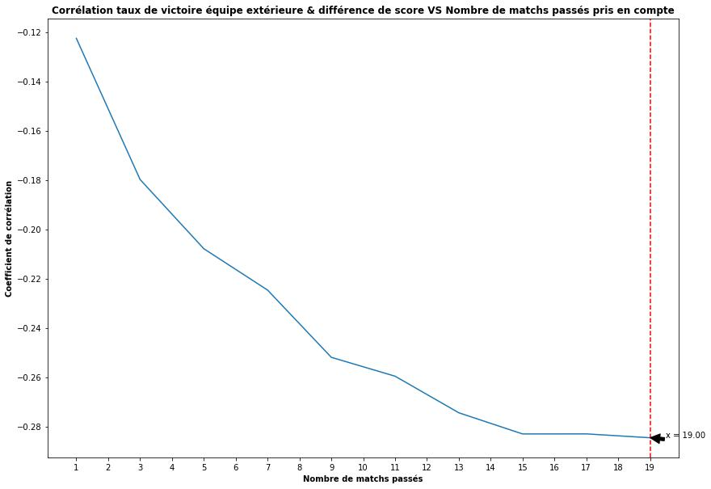
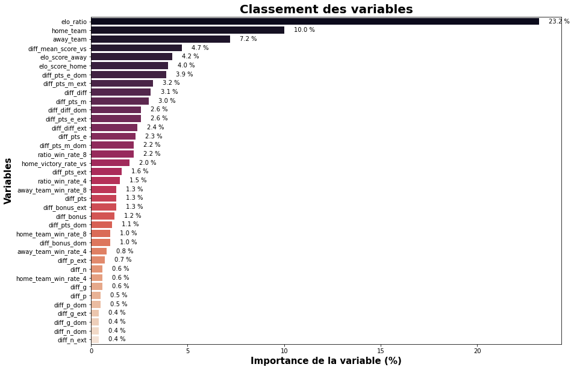
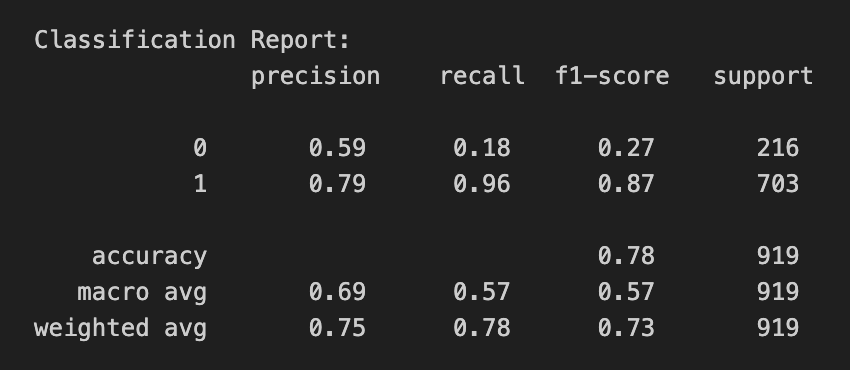
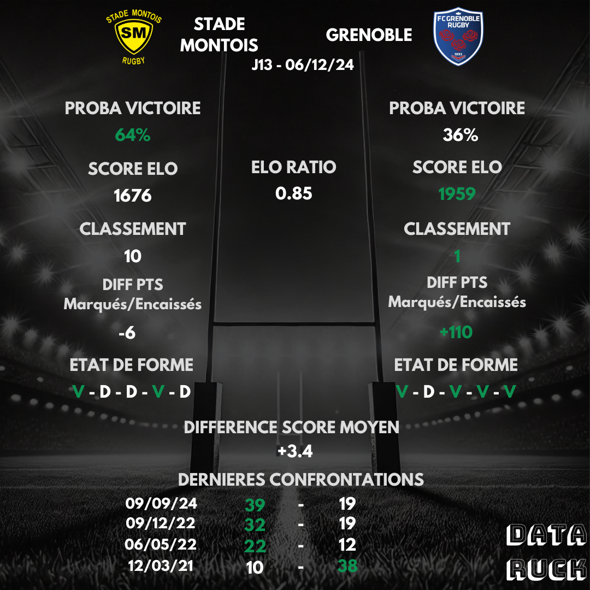

# Becoming a predictions maestro

Swept up in supporter fever, I often back my favourite team to win — and most of the time I'm wrong. So I started asking myself: is there a way to make more objective predictions? What's the actual probability my team wins? And what factors make one team more likely to beat another?

If you've read my previous article, you know that playing at home in TOP 14 or PRO D2 gives a significant edge. If you haven't yet, it's [right here](https://www.data-ruck.com/blog/rugby-home-advantages-en/) 👈

In this article, I'll walk through my methodology for building a machine learning model and evaluating how well it predicts match results!\
We'll cover:
1. The data available to train the model
2. Building a baseline to beat
3. Creating new features
4. Selecting the most relevant features
5. The limits of the analysis

If you're tired of making gut-feel predictions, this one's for you!

# 1. The data available to train the model

To make a decision, you need information. Data is the lifeblood of this kind of work — the more we have, the better we can model a phenomenon.

The phenomenon here is the result of a rugby match between two teams. We're working with historical results, league standings, and match statistics from both PRO D2 and TOP 14.\
Here's the breakdown of home team results:
- 73% wins
- 23% losses
- 4% draws

Since draws are rare and hard to predict, we'll focus on wins and losses only. Removing draws, the home win rate becomes **75%**.

# 2. A baseline model

To build and evaluate a model, we first need to define a performance metric and a baseline. How can we tell if a model is good without something to compare it to?\
Our performance metric will be accuracy: the percentage of correctly predicted outcomes (wins/losses).

**Baseline 1: a very biased model**

What if our baseline simply predicted a home win every single time? What accuracy would that give?

If you've been following, the answer is… **75%**. We just saw that home teams win 75% of their matches! This means our real model needs to beat 75% accuracy. This baseline is weak by design — it literally cannot predict an away win.

**Baseline 2: a slightly smarter model**

Let's be a little cleverer. We can use the points difference between the two teams in the league table at the time of the match to predict the result. The hypothesis: a team ranked higher is more likely to beat a lower-ranked opponent. Let's see:

*Score difference vs league points difference before the match*

The hypothesis holds — the bigger the gap in league points, the bigger the likely score difference. We can model this relationship with a linear regression (the red line above) and get the following formula:

$$ 
\begin{aligned}
Score\_Difference = Points\_Difference\times0.4 + 9.4
\end{aligned}
$$

***Quick example***: Stade Toulousain (76 league points) hosts La Rochelle (66 points) — our linear regression predicts a Toulouse win by 13 points:

$$ 
\begin{aligned}
13.4 = 10\times0.4 + 9.4
\end{aligned}
$$

***Fun fact***: when both teams are level on points, the home team still has a 9.4-point advantage built into the model.\
We use the model to predict match results:
- If score difference > 0, the home team wins.
- If score difference < 0, the home team loses.

This model achieves slightly better accuracy than the first one: **76%**.\
It's still easily improvable — it struggles early in the season, when league standings don't yet reflect team strength.

# 3. Creating new features

The goal here is to find and build new variables that will help the model predict match results. Any ideas?

Here's what came to mind that could give the model useful information:
- Win rate over different windows: last 1, 3, 6… matches
- Home and away win rates
- Win rate against the specific opponent
- Average points scored/conceded against the opponent
- ELO score

I also use a technique called **target encoding** for categorical variables (like team names): instead of the team name, we use its average win rate.

## ELO score

As mentioned, league standings don't always reflect team quality — especially in the early rounds of a season. So we compute an **ELO score**. Originally invented by physicist Arpad Elo to rate chess players, the ELO system is now used across sports like football and esports. Its logic is simple:
- The stronger a team performs, the higher its ELO score.
- If a team with a much higher ELO beats a much weaker one, it gains few points (and the weaker team loses few).
- If a team with a much higher ELO loses to a weaker one, it loses many points — and the weaker team gains proportionally.

For the most curious readers, the formula is in the appendix.\
Here's the result for the 2023–24 season:

*ELO score evolution in TOP 14, 2023–24 season*

## Win rate

Win rate is another important variable. My hypothesis: the ratio of the home team's win rate to the away team's win rate (over the last x matches) is correlated with the score difference.

Confirmed! There is a meaningful correlation (Pearson coefficient of 0.33) between this ratio and the score difference:

*Score difference vs win rate ratio between the two teams over recent matches*

But how many recent matches should we use? 2, 4, x? To answer this, I calculated the correlation between score difference and win rate for different window sizes:

*Correlation between score difference and away team win rate for different window sizes*

The curve plateaus around 10 matches, with a correlation of around -0.25 (the stronger the away team's recent form, the smaller the home vs away score difference).

# 4. Selecting the most relevant features

Once we've created these new variables, it's time to select the most informative ones. The idea: train a model to predict match outcomes and look at which variables contribute the most.

I won't go into all the detail here, but for the curious: I used a random forest model because it provides feature importance scores after training.

Here's the feature importance ranking:

*Feature importance ranking*

The most informative variables are:
- elo_ratio: the ratio of ELO scores between the two teams
- home_team: encoded home team (average win rate)
- away_team: encoded away team (average win rate)
- diff_mean_score_vs: average score difference in previous head-to-head encounters
- elo_score_home: ELO score of the home team
- elo_score_away: ELO score of the away team

Training the random forest on these variables gives an accuracy of **78%**. By engineering better features (= gaining more information), we gradually reduce uncertainty.

*Model evaluation report*

The model struggles most when predicting away wins — it correctly identifies only 20% of matches where the home team loses (recall above).

# 5. Limits of the analysis

There you go — no more gut-feel predictions! This data-driven, machine learning approach gives a more objective view of likely match outcomes. That said, this method is far from perfect and leaves out many factors: weather, team composition, injuries. In the end, these predictions give a steer — but rugby keeps its magic precisely because of the unpredictable, and that's why we love the sport.

Here's an example prediction for Round 13 between Stade Montois and Grenoble:

*PRO D2 predictions: Stade Montois - Grenoble*

I share predictions before every TOP 14 and PRO D2 round on [Twitter/X](https://x.com/DataRuck) 👈 and on [Instagram](https://www.instagram.com/data_ruck/) 👈.
If you enjoyed the article, feel free to follow!

## Appendix

### ELO score
For each team, the score is calculated in two steps:
1. Compute the win probability:
$$
\begin{aligned}
P_{teamA}=\frac{1}{1+10^\frac{Elo_{teamB}-Elo_{teamA}}{400}}\\
\end{aligned}
$$

2. Update the rating based on match outcome:
$$
\begin{aligned}
NewElo_{teamA} = OldElo_{teamA} + K \times (GameOutcome-P_{teamA})
\end{aligned}
$$
With $$GameOutcome=1$$ if team A wins, $$GameOutcome=0.5$$ for a draw and $$GameOutcome=0$$ if they lose.
