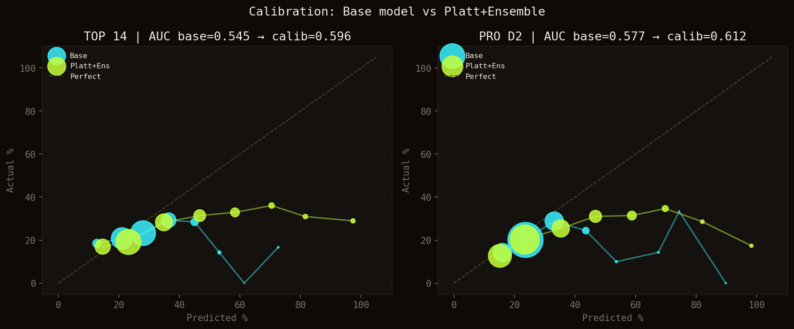
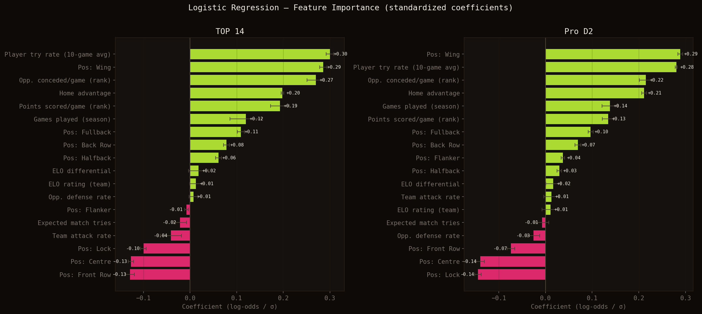
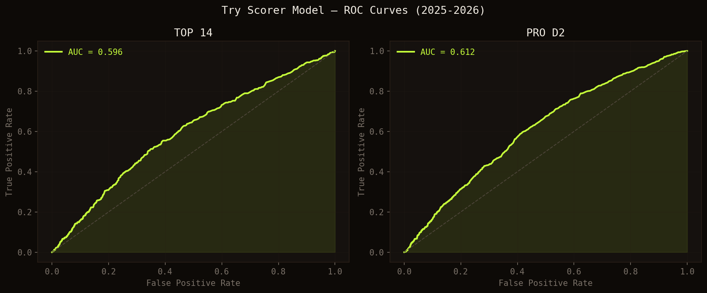
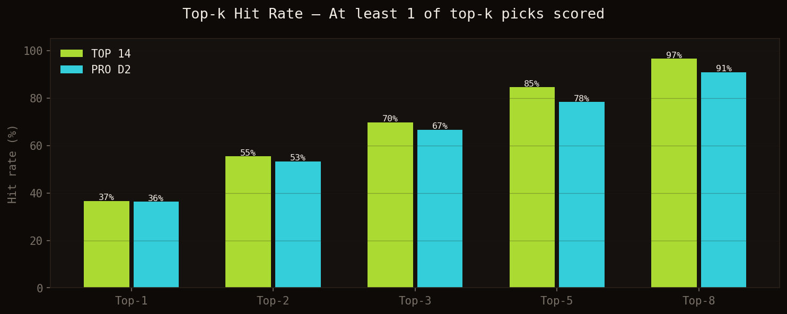
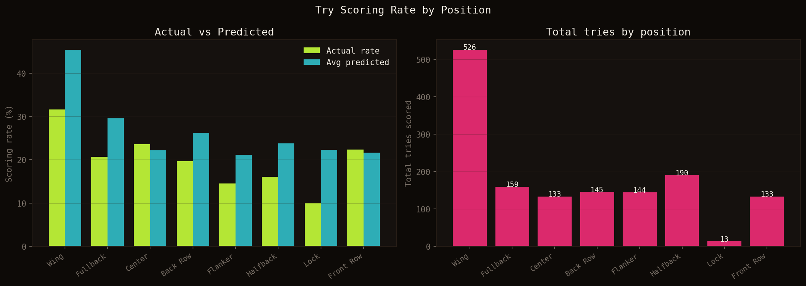
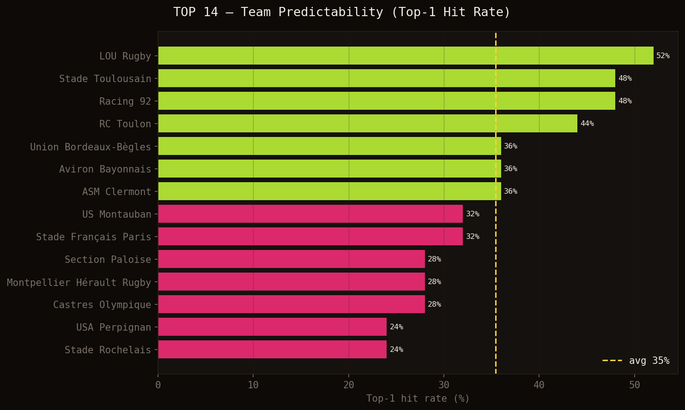
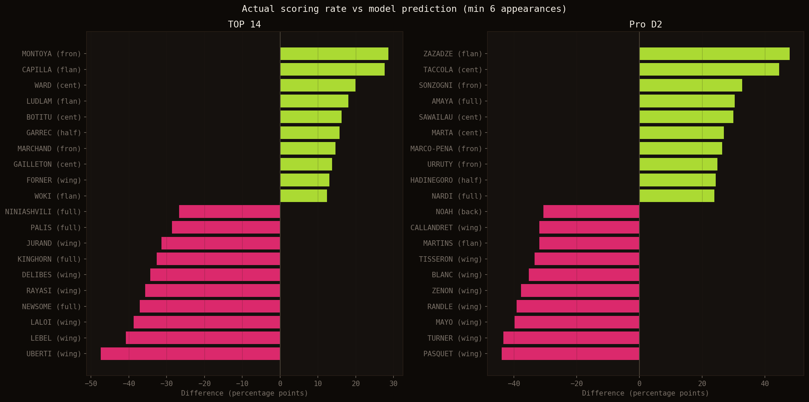
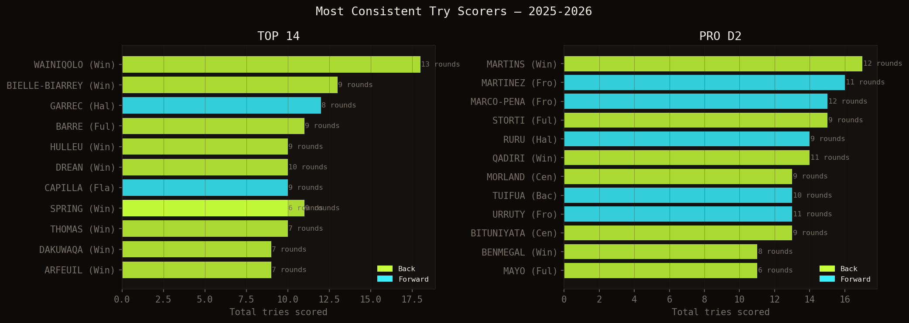
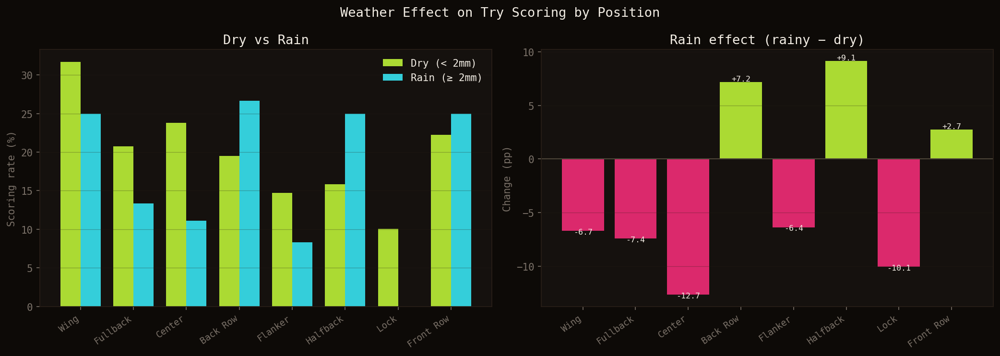

# Qui va marquer l'essai ?

C'est la question que tout supporter se pose avant chaque match. Wainiqolo va-t-il encore en marquer deux ? Bielle-Biarrey sera-t-il dans la zone d'en-but aujourd'hui ? Plutôt que de répondre au feeling, j'ai construit un modèle capable d'estimer la probabilité de marquer un essai pour chaque joueur titulaire, avant le coup d'envoi.

Dans cet article, je présente la méthodologie, les données utilisées, les résultats sur la saison 2025-2026, et quelques insights surprenants issus du backtest.

Les prédictions sont disponibles en direct sur la [page Analytics](https://www.data-ruck.com/predictions) 👈

# 1. Les données

Le modèle s'appuie sur trois sources de données collectées pour chaque match de TOP 14 et PRO D2 :

**Les feuilles de match** : pour chaque rencontre, je collecte la composition officielle (les 15 titulaires), les statistiques individuelles des joueurs et la chronologie complète des événements (essais, cartons, remplacements).

**L'historique des résultats** : tous les matchs depuis plusieurs saisons, avec les scores et les statistiques collectives.

**Le classement officiel** : les points marqués et encaissés par journée, utilisés comme proxy du niveau offensif/défensif de chaque équipe.

# 2. Les variables du modèle

Le modèle utilise **18 variables** pour estimer la probabilité qu'un joueur marque lors d'un match donné.

**Variables individuelles**
- `player_try_rate` : moyenne des essais sur les 10 derniers matchs (calculée par glissement — chaque prédiction n'utilise que les matchs passés)
- `games_played_season` : nombre de matchs joués cette saison — proxy de la régularité et de la confiance de l'entraîneur

**Variables collectives**
- `team_attack_rate` : essais moyens marqués par l'équipe sur ses 10 derniers matchs
- `opp_defense_rate` : essais moyens encaissés par l'adversaire
- `expected_match_tries` : somme des deux — indicateur d'ouverture du match. Un choc Toulouse-Racing aux défenses solides n'offrira pas les mêmes opportunités qu'une rencontre entre deux équipes offensives
- `is_home` : avantage domicile, mesurable même pour les marqueurs individuels

**Force relative**
- `elo_team` et `elo_diff` : score ELO de l'équipe et différentiel avec l'adversaire
- `rank_pts_scored_pg`, `rank_opp_conceded_pg` : points marqués/encaissés par match au classement officiel

**Position** : 8 variables binaires — ailier, arrière, centre, demi, flanker, troisième ligne centre, deuxième ligne, première ligne.

# 3. Le modèle

## Architecture

J'utilise une **régression logistique** avec équilibrage des classes pour compenser le déséquilibre naturel : un joueur ne marque que dans ~20% des matchs. Le modèle est entraîné sur toutes les saisons disponibles avant 2025-2026, puis évalué sur la saison en cours.

## Normalisation

Les probabilités brutes sont **normalisées par équipe** : leur somme est contrainte à égaler le nombre d'essais attendus dans le match. Si une équipe est censée marquer 3 essais et qu'un ailier capte la majorité de la probabilité brute, son score normalisé peut atteindre 50-60%.

## Calibration de Platt

La **calibration de Platt** est une technique introduite par John Platt (1999) pour ajuster les probabilités d'un modèle. L'idée : après l'entraînement principal, on apprend une seconde fonction sigmoïde qui mappe les sorties brutes du modèle vers des probabilités mieux calibrées. Concrètement, si le modèle tend à être trop confiant à 70%, la calibration le ramène à une valeur plus réaliste.

Dans mon implémentation, j'utilise une **validation croisée à 5 folds** (`CalibratedClassifierCV`, `method='sigmoid'`, `cv=5`) : cinq modèles indépendants sont entraînés sur des sous-ensembles différents des données, puis leurs prédictions sont moyennées. Cet **effet d'ensemble** améliore le classement des joueurs (AUC +9%) au-delà de la simple calibration.

*Courbes de calibration : modèle de base (bleu) vs Platt + ensemble (vert). L'AUC passe de 0.555 à 0.596 en TOP 14, et de 0.590 à 0.612 en PRO D2.*

> ⚠️ Les scores affichés sont des **scores relatifs**, pas des probabilités absolues. Un joueur à 60% ne marquera pas dans 60% de ses matchs — cela signifie qu'il est le candidat le plus probable de son équipe dans ce contexte précis.

## Importance des variables

La régression logistique est entièrement interprétable : les coefficients du modèle, après normalisation des variables (StandardScaler), sont directement comparables. Chaque coefficient représente l'effet d'**un écart-type de la variable** sur le log-odds de marquer un essai, toutes les autres variables étant maintenues constantes.

*Coefficients standardisés du modèle en TOP 14 (gauche) et PRO D2 (droite). Vert = contribue positivement à la probabilité de marquer ; rouge = contribue négativement.*

Cinq enseignements ressortent nettement :

**1. L'historique individuel domine.** `player_try_rate` — la moyenne glissante des essais sur les 10 derniers matchs — est le signal individuel le plus fort (+0.30 en TOP 14, +0.28 en PRO D2). Un joueur qui marque régulièrement continue de le faire : la régularité n'est pas accidentelle.

**2. La position est une structure.** Être ailier est presque aussi déterminant que l'historique personnel (+0.29 en TOP 14). À l'inverse, le verrou (-0.10 / -0.14) et la première ligne (-0.13 / -0.07) pèsent négativement. Ces coefficients captent le profil de jeu intrinsèque de chaque poste — l'ailier finit les actions, le pilier les crée.

**3. Les classements battent les moyennes roulantes.** Parmi les variables de contexte collectif, les indicateurs de classement (`rank_pts_scored_pg`, `rank_opp_conceded_pg`) ont un impact deux à quatre fois supérieur aux moyennes roulantes brutes (`team_attack_rate`, `opp_defense_rate`). Le classement aggrège l'ensemble de la saison — c'est un proxy de qualité plus stable que les 10 derniers matchs.

**4. L'avantage domicile est réel et significatif.** Le coefficient `is_home` est de +0.20 en TOP 14 et +0.21 en PRO D2 — l'un des effets les plus stables et les plus forts parmi les variables non-positionnelles. Jouer à domicile augmente la probabilité de marquer même au niveau individuel.

**5. L'ELO apporte peu à l'échelle individuelle.** Le différentiel ELO entre les deux équipes n'a qu'un coefficient de +0.018 — le plus faible de toutes les variables continues. À l'échelle du match, la force relative des équipes est déjà capturée par les variables de classement ; au niveau du joueur, elle devient marginale.

Ces résultats sont remarquablement stables entre le TOP 14 et le PRO D2, ce qui donne de la robustesse aux conclusions.

# 4. Résultats — Saison 2025-2026

## Comment interpréter l'AUC et le top-k hit rate

L'**AUC** (Area Under the ROC Curve) est la mesure standard pour évaluer un modèle de classement. Pour l'interpréter de façon intuitive : imaginez que l'on choisisse au hasard un joueur qui a marqué et un qui n'a pas marqué dans le même match. L'AUC représente la probabilité que le modèle ait attribué un score plus élevé au marqueur. Une AUC de 0.5 signifie que le modèle ne fait pas mieux que le hasard ; 1.0 signifie qu'il est parfait. Nos **0.596 en TOP 14 et 0.612 en PRO D2** montrent que le modèle identifie correctement le marqueur dans près de 60% de ces comparaisons — sur un problème intrinsèquement difficile où le rugby garde toute son imprévisibilité.

Le **top-k hit rate** est une mesure plus pratique : dans quel pourcentage de matchs au moins un des k meilleurs pronostics du modèle a-t-il effectivement marqué ?

*Courbes ROC — plus la courbe est éloignée de la diagonale, meilleur est le modèle.*

*En choisissant les 3 meilleurs pronostics, on touche un marqueur réel dans 70% des matchs de TOP 14 (67% en PRO D2). Avec 5 pronostics, on monte à 85% en TOP 14 et 78% en PRO D2.*

> **Performance Hit 5** — En sélectionnant les 5 joueurs les mieux notés toutes équipes confondues, le modèle couvre un vrai marqueur dans **85% des matchs de TOP 14** et **78% des matchs de PRO D2**. Autrement dit, seulement 1 match sur 6 (TOP 14) produit un essai en dehors du top 5 des pronostics.

## Scoring par position

*Taux de marquage réel vs prédit par position (gauche) et total d'essais sur la saison (droite, TOP 14 + PRO D2 combinés).*

Les ailiers et arrières dominent logiquement le classement. Ce qui est plus intéressant : le modèle **sous-estime les troisièmes lignes centre et flankers** par rapport à leur taux réel. Ces positions ont un profil d'essais moins prévisible mais bien réel — les offensives au contact, les mauls qui débordent, les avants qui surgissent en bout de ligne. Le modèle a encore des progrès à faire sur ces profils atypiques.

## Les équipes les plus prévisibles

*Taux de réussite top-1 par équipe en TOP 14 — dans quel pourcentage de matchs le joueur le mieux noté par le modèle a-t-il effectivement marqué ?*

**LOU Rugby** est l'équipe la plus prévisible (52%) : la concentration des essais autour de Wainiqolo rend la prédiction relativement fiable. **Racing 92** et **Stade Toulousain** se retrouvent à 48% à égalité — mais pour des raisons opposées. Racing a quelques marqueurs réguliers bien identifiés, tandis que Toulouse est l'équipe qui marque le plus d'essais du championnat (72 sur la saison, 27 joueurs différents au marquage), ce qui dilue la prédiction individuelle. Quand n'importe quel joueur de l'effectif peut marquer, le modèle a du mal à en désigner un en particulier.

À l'opposé, **USA Perpignan** et **Stade Rochelais** sont les plus difficiles à prédire (24%). Perpignan marque peu (18 essais au total) et les essais sont éparpillés ; La Rochelle, malgré ses 55 essais, les distribue à 17 joueurs différents.

## Les joueurs qui surprennent le modèle

*Écart entre taux de marquage réel et prédiction du modèle, par championnat. En vert : sous-estimés par le modèle. En rouge : surestimés.*

**Matthis LEBEL (Stade Toulousain)** est la plus grande déception du modèle en TOP 14 : −41 points de pourcentage en-dessous de la prédiction. Il a marqué dans 5 journées sur 17 prédites (29%), pour une prédiction moyenne de 70%. Ailier international de classe mondiale, le modèle lui attribuait systématiquement de fortes probabilités — mais Toulouse a dilué ses essais sur l'ensemble de l'effectif (27 marqueurs différents cette saison). Quand n'importe qui peut marquer, même le meilleur marqueur statistique sous-performe en terme de régularité par match.

À l'inverse, **Juliàn MONTOYA (Section Paloise)** a surpris par le haut : +29 points de pourcentage au-dessus de la prédiction (50% réel contre 21% prédit). Un talonneur dont le profil défensif n'attire pas l'attention du modèle, mais qui a su être au bon endroit au bon moment tout au long de la saison.

**Gaël DREAN (Toulon)**, en revanche, illustre ce que le modèle fait bien : 71% de taux réel pour 65% prédit. Un écart quasi nul — le profil d'un ailier dominant dans une attaque efficace, parfaitement capturé.

## Les marqueurs les plus réguliers

*Joueurs ayant marqué dans le plus grand nombre de journées différentes. Wainiqolo (18 essais, 13 journées) est dans une catégorie à part.*

**Jiuta Naqoli WAINIQOLO** (18 essais en 25 journées, 13 journées différentes) domine le classement. **Louis BIELLE-BIARREY** (13 essais) complète le duo de tête du TOP 14. Ces deux joueurs ont en commun d'être classés #1 par le modèle dans la grande majorité de leurs matchs — ce qui confirme que leur régularité n'est pas accidentelle.

## Effet de la météo

*Impact de la pluie (≥ 2mm) sur le taux de marquage par position. Chiffres combinés TOP 14 + PRO D2, saison 2025-2026.*

L'analyse révèle un effet marqué de la pluie sur la répartition des essais entre positions. Les **centres** sont les plus pénalisés avec une chute de **-12.7 points de pourcentage** (23.8% à sec → 11.1% sous la pluie). Les **arrières** et **ailiers** perdent également du terrain (-7.4pp et -6.7pp respectivement). La logique est claire : la pluie réduit les jeux larges, les offloads et les attaques de ligne qui bénéficient à ces positions.

À l'inverse, les **demis** voient leur taux de marquage augmenter significativement (+9.1pp, de 15.9% à 25.0%), tout comme les **troisièmes lignes centre** (+7.2pp) et, dans une moindre mesure, les **premières lignes** (+2.7pp). Par temps de pluie, le jeu devient plus direct, plus physique, plus proche des rucks et des mêlées — on s'attend à ce que les avants, et particulièrement la première ligne, en bénéficient à travers les picks-and-gos et les mauls victorieux. Les données montrent bien une tendance dans ce sens pour les premières lignes, mais l'effet reste plus discret que pour les demis ou les troisièmes lignes.

Il faut rester prudent sur ces chiffres : ils sont basés sur un nombre limité de matchs sous la pluie cette saison. La tendance est cohérente avec la logique du jeu, mais méritera d'être consolidée sur plusieurs saisons avant d'en tirer des conclusions définitives.

# 5. Ce que le modèle ne sait pas encore

Plusieurs améliorations intéressantes restent à explorer :
- **Les minutes jouées** : un titulaire 80 minutes n'a pas les mêmes opportunités qu'un impact sub
- **Un ELO individuel** : deux ailiers de la même équipe ont des niveaux très différents
- **La météo comme variable d'entraînement** : les données sont disponibles et les résultats ci-dessus montrent un signal réel
- **La série en cours** : un joueur qui marque 3 matchs d'affilée a-t-il statistiquement plus de chances de continuer ?
- **Les confrontations directes** : certains joueurs ont des profils très différents selon l'adversaire

# Conclusion

Prédire qui va marquer un essai reste un défi — le rugby est imprévisible, c'est ce qui le rend passionnant. Mais les données montrent qu'il existe bien un signal exploitable : les joueurs qui marquent régulièrement continuent de le faire, et les équipes offensives face à des défenses perméables créent structurellement plus d'opportunités.

Les prédictions sont mises à jour chaque journée sur la [page Analytics](https://www.data-ruck.com/predictions). Si vous êtes curieux de voir qui le modèle désigne comme favori pour le prochain match, c'est par là 👈

Si vous avez des idées de variables ou des questions sur la méthodologie, n'hésitez pas à me contacter !
