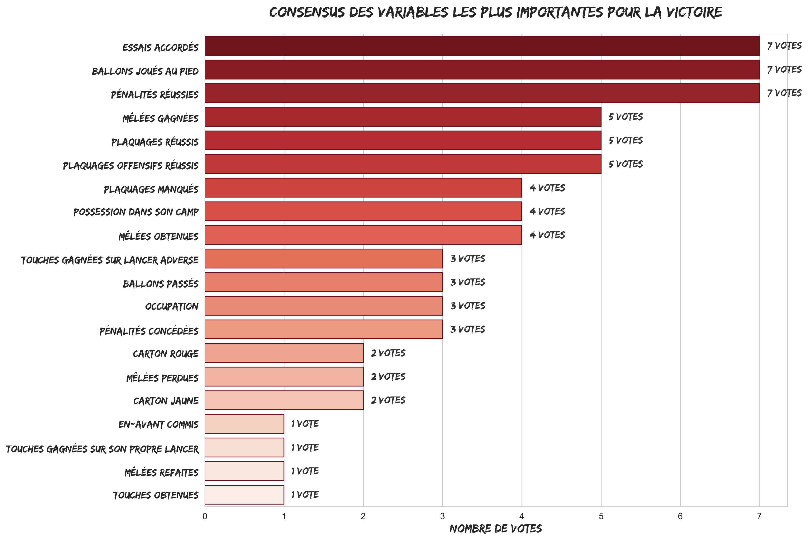

# Quelles statistiques font vraiment gagner en TOP 14 et PRO D2 ?

*Spoiler : ce n’est pas la possession.*

Que vous soyez analyste, entraîneur, passionné ou simplement quelqu’un qui a hurlé devant votre télé en voyant votre équipe multiplier les en-avant, une question revient toujours :

“Qu’est-ce qui fait vraiment gagner un match de rugby ?”

Christophe Urios: "*Là, je ne vais pas mettre de GPS : je vais sentir les mecs.*"

Est-ce l'occupation ? la mêlée ? le jeu au pied ? 
Ou est-ce, comme certains le crient au comptoir, “les arbitres, c’est toujours les arbitres” ?

Dans cet article, on arrête les débats de comptoir.
On sort les données. Beaucoup de données. Les matchs des 3 dernières saisons de TOP 14 et de PRO D2, tous disséqués par plusieurs modèles statistiques.

Et vous allez voir… le rugby réserve parfois des surprises.

---
# 🧠 Méthodologie : comment j'ai cuisiné les données

J'ai sélectionné  **24 variables**, chacune exprimée sous forme d’une différence entre les deux équipes (Essais accordés, Nombre de ballons joués au pied, Mêlées gagnées...). J'ai ensuite voulu comprendre 
le lien entre ces variables et le résultat du match.

Pour cela j’ai sorti l’artillerie lourde en termes de modélisation, avec 7 approches complémentaires (le détail pour les plus téméraires):

### 1. Screening initial : corrélation et information mutuelle
- **Corrélation** : on mesure la relation linéaire entre chaque variable et le résultat du match.  
- **Information mutuelle (Mutual Information)** : mesure non linéaire de la dépendance entre chaque variable et le résultat.  
- **Objectif** : détecter rapidement les variables qui semblent les plus liées à la victoire avant de passer aux modèles complexes.

### 2. Régression logistique pénalisée L1 (Lasso)
- **But** : sélectionner les variables les plus pertinentes et quantifier leur effet.
- **Comment ça marche** : on modélise la probabilité de victoire comme une fonction linéaire des variables (diff_Essais accordés, diff_Pénalités réussies, etc.) et on ajoute une **pénalité L1** qui force les coefficients non importants à devenir exactement zéro.
- **Avantage** : on obtient un modèle **interprétable**, où les coefficients nous disent si une variable augmente ou réduit la probabilité de victoire.

### 3. Régression logistique L2 (ridge)
- **But** : modéliser la probabilité de victoire en considérant toutes les variables.  
- **Caractéristique** : pénalité L2 qui réduit la variance et évite le surapprentissage.  
- **Sortie** : coefficients interprétables indiquant si une variable augmente ou diminue la probabilité de victoire.  

### 3. Random Forest
- **But** : capturer des relations complexes et non linéaires.
- **Comment ça marche** : un ensemble d’arbres de décision est construit, chacun sur un échantillon aléatoire des matchs et des variables. Chaque arbre “vote” pour la victoire ou la défaite.
- **Avantage** : excellent pour détecter des **interactions entre variables**, par exemple : l’effet combiné d’un carton jaune et d’une possession faible dans le camp adverse.
- **Sortie** : l’importance des variables est mesurée par la réduction moyenne de l’impureté (Gini) apportée par chaque variable.

### 4. Permutation Importance
- **But** : confirmer l’importance des variables sur un modèle déjà entraîné (ici Random Forest).  
- **Comment ça marche** : on mélange (permute) les valeurs d’une variable et on observe la baisse de performance.  
- **Avantage** : mesure robuste de l’influence réelle sur la prédiction.  

### 5. Stability Ranking
- **But** : mesurer la robustesse des variables importantes à travers plusieurs échantillonnages.  
- **Comment ça marche** : on entraîne plusieurs Random Forest sur des sous-échantillons en cross-validation et on moyenne les rangs d’importance.  
- **Avantage** : identifie les variables qui restent importantes quel que soit l’échantillon.  

### 6. Gradient Boosting
- **But** : améliorer la prédiction en corrigeant progressivement les erreurs d’un modèle faible.
- **Comment ça marche** : on construit des arbres successifs, chacun essayant de corriger les erreurs des précédents.  
- **Avantage** : très performant en prédiction et robuste aux variables bruitées.
- **Sortie** : scores d’importance des variables, souvent concordants avec Random Forest, mais plus sensibles aux relations subtiles.

### 7. Analyse SHAP (SHapley Additive exPlanations)
- **But** : comprendre l’influence de chaque variable sur chaque prédiction.
- **Comment ça marche** : pour chaque match, SHAP distribue “l’effet” de la prédiction entre toutes les variables, inspiré de la théorie des jeux.
- **Avantage** : permet de visualiser l’impact **global et local** d’une variable :  
  - Global : quelles variables expliquent en moyenne la victoire ?  
  - Local : pour un match précis, pourquoi une équipe a-t-elle gagné ou perdu ?

Enfin, j’ai construit un score de "consensus":
  - Chaque méthode “vote” pour ses top variables.  
  - Les variables les plus souvent sélectionnées apparaissent en tête du classement. 
---

# 🏆 Résultats : les facteurs qui influencent le plus la victoire

Après croisement des méthodes, un classement clair s’impose. 
Voici le **classement des votes**: 

Classement des votes

### 🥇 **1. Les essais accordés**  
Sans surprise, c’est *la* variable reine. Merci Sherlock !
Plus vous marquez d'essais, plus vos chances de gagner augmentent.

Sur la saison 2025-2026, l'équipe de TOP 14 qui plante le plus d'essais par match en moyenne est... le Stade Toulousain avec 5.4 essais par match !

Pour la pro D2, c'est le RC Vannes qui est le plus prolifique à ce niveau: une moyenne de 5 essais/match.

---

### 🥈 **2. Les pénalités réussies**  
Évident aussi... Oui, les pénalités rapportent des points et donc augmentent les chances de victoire.  

En Top 14, c'est l'aviron Bayonnais qui domine ce classement, avec une moyenne de 2.05 pénalités réussies par match sur la saison 2025-2026.

En Pro D2, c'est Valence Romans qui reussi le plus de pénalités, avec une moyenne de 2.6 pénalités réussies par match.

---

### 🥉 **3. Le jeu au pied : Ballons joués au pied**  

C'est la que ça devient intéressant !
Les équipes qui utilisent leur jeu au pied gagnent davantage.  
C'est un marqueur tactique : occupation, pression territoriale, forcing d’erreurs.

Sur la saison 2025-2026, l'équipe de TOP 14 qui a le plus joué au pied (28 en moyenne par match) est... Montpellier !
En Pro D2, c'est Oyonnax qui domine ce classement (30 ballons joués au pied en moyenne par match).

---

### **4. Les Mêlées gagnées**

Le pack d'avant joue bien évidemment un rôle crucial dans la victoire.
Les équipes qui dominent en mêlée ont un avantage stratégique important.

Sur la saison 2025-2026, l'équipe de TOP 14 qui gagne le plus de mêlées (43% en moyenne par match) est... le RC Toulon!

En Pro D2, c'est Oyonnax qui domine ce classement (30% en moyenne par match).

---

### **5. Les Plaquages Réussis**

Une défense efficace est également un facteur clé de la victoire. 

Le plus gros plaqueur de la saison 2025-2026 en TOP 14, c'est Esteban Abadie. 
En prod D2, c'est le joueur de Dax, Arnaud Aletti, avec 106 plaquages réussis au total.	

---

# 📊 Conclusion : les clés de la victoire.

Au moment de refermer cet article, on peut au moins trancher un débat de comptoir : non, la victoire ne se résume ni à la possession, ni (désolé) uniquement aux arbitres.

Et comme dirait Christophe Urios, on pourrait être tenté de “sentir les mecs”… mais les données racontent une autre histoire.

Parce qu’au fond, le rugby moderne aime bien nous contredire. Garder le ballon, enchaîner les temps de jeu, faire lever le stade… c’est beau. Mais ce n’est pas toujours ce qui fait gagner.

Ce qui fait gagner, plus souvent qu’on ne le pense, c’est cette diagonale bien sentie, ce jeu d’occupation propre, ce moment où l’on accepte de rendre le ballon… pour mieux reprendre la main, 40 mètres plus loin, avec un peu plus de pression.

Bref, gagner au rugby, ce n’est pas forcément jouer plus. C’est jouer plus juste.

Alors la prochaine fois que vous verrez votre équipe taper au pied, attendez une seconde avant de râler : il y a peut-être déjà, dans ce coup de pied, un petit bout de la victoire.